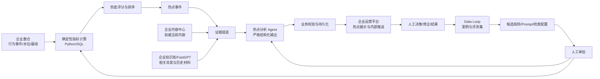

# NewsAgent 业务落地场景说明

> 文档状态：业务初稿 v0.5  
> 创建日期：2026-09-15  
> 适用范围：NewsAgent 项目根目录及其子系统  
> 维护方式：本文件用于持续澄清业务场景、输入契约和验收边界；每次确认新事实后再迭代，不以临时猜测替代企业侧真实约定。

## 1. 文档目的

本文件描述 NewsAgent 要落地的企业业务场景，并作为产品、数据、算法、后端、前端和运维之间的共同上下文。重点回答以下问题：

1. NewsAgent 为谁提供什么服务。
2. 企业数仓、内容中心和知识库分别需要提供什么输入。
3. 热点发现、热点分析、运营策略和热点推送如何形成完整链路。
4. 哪些结果必须由 Python/SQL 确定性计算，哪些工作可以交给大模型。
5. 系统如何从运营反馈中形成可审计、可回放的业务进化闭环。
6. 当前代码已经覆盖什么，距离企业生产接入还缺什么。

文中使用以下状态标记：

- **[已确认]**：用户已经明确，或当前代码与项目上下文已形成一致结论。
- **[当前实现]**：仓库内已有对应代码，但不等于已经接入企业生产环境。
- **[设计建议]**：适合作为初稿继续讨论，尚未成为最终业务约定。
- **[待确认]**：必须由业务方、数据方或平台方补充，不能由项目自行假定。

## 2. 一句话业务定位

**[已确认]** NewsAgent 是面向企业运营平台的智能体服务层：对接企业数仓中的实时或准实时热点数据、企业内容中心和知识库，完成热点发现、证据增强、运营策略分析与热点推送，并将运营人员的决策和后续效果沉淀为可评估、可审批的业务进化数据。

NewsAgent 不替代企业数仓、内容中心、知识库平台、运营平台或内容发布系统。它位于这些系统之间，负责把确定性的业务数据转换为可解释、可执行但受约束的运营建议。

## 3. 业务背景

企业运营通常已经拥有新闻内容、曝光点击行为、用户消费行为、渠道信息和运营规则，但这些数据分散在数仓、内容中心、知识库和不同运营工具中，存在以下典型问题：

- 热点依赖人工浏览和经验判断，发现速度不稳定。
- 行为数据能说明“什么正在升温”，但难以直接说明“为什么升温”。
- 内容和知识库能提供背景材料，但不能代替权威指标计算。
- 热度结论、引用证据、运营策略和执行结果容易散落在多个系统中。
- 大模型输出可能出现数字漂移、引用失真、过度推断或提示注入风险。
- 运营经验常停留在个人层面，缺少可复用、可评估、可回滚的组织资产。

NewsAgent 的核心价值不是简单生成一段热点摘要，而是将“数据事实—内容证据—运营判断—人工决策—效果反馈”组织成一条可信业务链路。

## 4. 目标与非目标

### 4.1 当前业务目标

1. 对企业数仓的指定时间窗进行热点发现，输出可解释的热点排序。
2. 根据 `news_id` 获取权威内容，并从企业知识库召回相关背景与历史材料。
3. 在严格 Schema 下生成热点趋势判断、驱动因素、运营建议、风险和证据引用。
4. 将热点结果推送到企业运营平台，支持查看、确认、驳回、修正和转交写作。
5. 保存分析批次、规则版本、Prompt 版本、证据和人工决策，支持回放与审计。
6. 将失败案例、人工修正和业务效果转为 Data Loop 的评估数据。
7. 在人工审批边界内迭代 Prompt、热度规则、检索排序配置和输出 Schema。

### 4.2 当前明确不做的事情

- 不让 LLM 直接计算曝光、点击、CTR、增速、基线或最终热度分数。
- 不让新闻正文、检索材料或外部模型输出中的指令改变系统控制逻辑。
- 不在 NewsAgent 本地保存企业原始用户行为明细；只保存必要的聚合快照、版本和证据引用。
- 不把 FastGPT 描述为 NewsAgent 自主实现的能力；FastGPT 是外部知识库与模型应用基础设施。
- 不默认自动发布内容到外部渠道。热点推送首先是企业内部运营通知，生产发布属于另一条高风险链路。
- 不在当前阶段自动训练或自动上线新模型。
- 不替代企业统一身份、权限、审计、数据治理和内容合规体系。

## 5. 参与角色与系统边界

| 参与方 | 主要职责 | 与 NewsAgent 的关系 |
| --- | --- | --- |
| 企业运营人员 | 查看热点、评估建议、决定跟进方式、填写修正和结果 | 核心使用者与人工审批者 |
| 运营平台 | 承载热点列表、详情、决策、推送状态和写作转交 | NewsAgent 的上游入口与下游展示端 |
| 企业数仓/实时计算平台 | 提供行为事件、水位、聚合基线和数据版本 | 权威业务指标来源 |
| 企业内容中心 | 提供 `news_id` 对应的权威正文、状态、版本和媒体信息 | 权威当前内容来源 |
| 企业知识库/FastGPT | 保存并检索背景材料、历史新闻、规则和参考知识 | 外部检索与模型应用基础设施 |
| NewsAgent | 确定性计算、证据组装、受约束分析、工作流和反馈闭环 | 智能体服务与编排层 |
| 内容生产/写作系统 | 接收经人工确认的热点分析，发起研究和写作 | 可选下游 |
| CMS/渠道发布系统 | 承担最终发布、撤回和渠道控制 | 高风险外部副作用边界 |
| 数据/算法/合规人员 | 维护数据契约、规则、评测集、审批与审计 | 治理参与者 |

## 6. 核心业务场景

### 6.1 场景 A：实时热点发现

**触发方式**：定时窗口、业务事件或运营人员手动触发。

**主要过程**：

1. 确认行为数仓的水位已经覆盖目标时间窗。
2. 拉取时间窗内的曝光、点击、阅读、播放和互动事件。
3. 使用 Python/SQL 计算新闻粒度指标，并查询对应基线。
4. 按版本化规则计算热度分数、排序和候选集合。
5. 合并或更新热点事件，避免同一热点在连续窗口中被重复创建。

**业务输出**：热点候选、排名、热度分数、指标快照、基线、规则版本、数据版本和窗口信息。

### 6.2 场景 B：热点证据增强与策略分析

**触发方式**：热点候选达到分析门槛，或运营人员点选分析。

**主要过程**：

1. 按 `news_id` 从内容中心获取当前权威内容。
2. 从知识库召回相关历史新闻、背景知识和必要的业务规则。
3. 对召回结果执行过滤、去重、排序和证据白名单整理。
4. 将确定性指标、当前内容、相关证据和策略上下文组成结构化输入。
5. 通过 FastGPT 模型应用生成严格结构化的热点分析。
6. 对输出执行 Schema、数字引用、证据引用、因果表达和置信度校验。

**业务输出**：趋势判断、可能驱动因素、热点原因、相关背景、运营动作建议、风险、证据缺口、引用列表和置信度。

其中“驱动因素”和“因果关系”默认只能表达为有证据约束的分析判断，不应伪装成已被数据证明的事实。

### 6.3 场景 C：热点推送与运营决策

**[已确认]** 热点分析结果需要推送给企业运营平台。

初稿将“热点推送”定义为：把满足门槛的热点事件和分析结果送入企业内部运营工作台或通知渠道，供运营人员决策；它不等同于把生成内容直接发布给终端用户。

运营人员可执行的动作建议包括：

- 确认热点并进入选题池。
- 驳回误报或标记证据不足。
- 修正热点主题、原因或策略建议。
- 标记持续关注、降低优先级或结束热点。
- 转交研究/写作流程。
- 选择目标业务线、运营栏目或内部通知渠道。

推送需要支持幂等键、去重、状态回执、失败重试、人工门槛和完整审计。

### 6.4 场景 D：研究与写作转交

经运营人员确认的热点可以创建写作任务。热点链路提供主题、指标、证据和策略上下文，研究/写作链路继续完成资料研究、写作、复核和产物保存。

热点 Agent 与写作 Agent 必须保持边界：热点分析完成不代表内容已经批准发布；任何外部发布仍需单独授权和人工审批。

### 6.5 场景 E：运营反馈与业务进化

系统收集以下反馈：

- 输出校验失败、低置信度和证据不足。
- 检索为空、召回错误或内容版本不一致。
- 运营人员确认、驳回、修正和补充说明。
- 是否进入写作、是否采用、是否触达目标渠道。
- 后续热点走势与业务效果指标。

这些反馈先形成可追溯案例，再经过标注、审批和冻结形成评测集。系统基于评测结果生成 Prompt、热度规则、检索排序配置或 Schema 的候选版本，但生产启用仍需人工审批。

## 7. 业务闭环



闭环由三部分组成：

1. **在线业务链路**：在每个时间窗内发现、分析和推送热点。
2. **Data Loop**：把失败、反馈和效果整理为版本化评估数据。
3. **Model Loop**：对候选策略进行离线回放和人工审批，不允许直接自我修改生产配置。

## 8. 企业输入契约

### 8.1 行为数仓输入

#### 8.1.1 业务用途

行为数据只用于回答“什么正在升温、哪些内容受到关注、变化是否异常”。原始行为事件在计算窗口内读取和聚合，不作为本项目的长期本地数据资产。

#### 8.1.2 当前接口语义

**水位请求**：

| 字段 | 含义 | 要求 |
| --- | --- | --- |
| `tenant_id` | 企业租户 | 必填，来自可信网关或任务上下文 |
| `dataset` | 行为数据集 | 必填，需与企业数仓约定 |
| `required_through` | 本次窗口要求覆盖到的时间 | 必填 |

**事件查询**：

| 字段 | 含义 | 要求 |
| --- | --- | --- |
| `window_start` / `window_end` | 查询窗口 | 使用半开区间 `[start, end)` |
| `news_ids` | 指定新闻范围 | 可选 |
| `content_types` | 文章/视频等类型 | 可选 |
| `page_size` / `page_token` | 分页控制 | 必须支持稳定翻页 |

**事件行建议最小字段**：

| 字段 | 含义 | 当前约束 |
| --- | --- | --- |
| `event_id` | 事件唯一标识 | 用于去重和审计 |
| `anonymous_user_key` | 匿名用户键 | 不得反推出企业用户原始身份 |
| `news_id` | 新闻统一业务键 | 与内容中心和知识库一致 |
| `event_type` | 行为类型 | `impression/click/read/play/like/comment/share/favorite` |
| `event_time` | 事件时间 | 必须在查询窗口内 |
| `content_type` | 内容类型 | 当前至少 `article/video` |
| `duration_milliseconds` | 阅读或播放时长 | 非负，可空 |
| `channel` | 渠道 | 可选，枚举需统一 |
| `device_type` | 设备类型 | 可选，枚举需统一 |

**分页响应还需包含**：`next_page_token`、`watermark`、`data_version`。同一次窗口查询的所有分页必须使用稳定的数据版本；若水位不足、版本变化、记录越界或数据规模超过保护上限，本次分析应失败关闭或降级为明确的“不完整数据”状态，不能生成伪完整结论。

#### 8.1.3 数仓侧待确认事项

- **[待确认]** 企业实际提供 RPC、SQL 网关、流式 Topic 还是其他协议。
- **[待确认]** 实时 SLA、允许延迟、水位定义和补数机制。
- **[待确认]** 各事件的业务口径、去重规则和迟到事件处理方式。
- **[待确认]** UV、有效消费、互动、视频完播等指标的企业权威定义。
- **[待确认]** 租户、业务线、栏目、渠道和用户群的维度编码。
- **[待确认]** 单窗口数据量、QPS、分页上限和历史回放范围。

### 8.2 指标基线输入

热点判断不能只看当前窗口绝对值，还需要同口径基线。基线请求至少包含：

- 当前时间窗。
- `(news_id, content_type)` 指标键集合。
- `baseline_policy_version`。
- 分页信息。

基线响应当前可承载：`sample_count`、曝光、点击、UV、总消费时长、有效消费、互动数和 CTR，并附带 `data_version` 与实际使用的基线策略版本。

**[待确认]** 企业最终采用环比、同比、同频道、同内容类型、生命周期阶段还是组合基线，以及冷启动内容的兜底口径。

### 8.3 内容中心输入

内容中心负责回答“这条新闻当前权威版本是什么”。热点分析必须先按 `news_id` 精确取当前内容，再做相关内容检索。

建议最小输入如下：

| 字段 | 用途 | 状态 |
| --- | --- | --- |
| `tenant_id`、`news_id` | 租户隔离与统一关联 | 必需 |
| `content_version` | 版本追踪、纠错和重建索引 | 必需，企业字段待映射 |
| `content_type` | 文章、视频及后续类型 | 必需 |
| `title`、`summary`、`body` | 当前文本内容 | 按类型必需 |
| `publish_time`、`source` | 时效与来源判断 | 必需 |
| `channel`、`tags`、`entities` | 过滤、检索和运营路由 | 建议提供 |
| `status` | 草稿、发布、修正、撤回、删除等 | 必需 |
| `source_url` | 原始证据定位 | 建议提供 |
| `media_uri`、`duration` | 视频/音频处理 | 视频建议提供 |
| `transcript`、`visual_summary` | 多模态内容文本化 | 可由内容中心提供或由受控服务生成 |
| `updated_at`、`effective_at` | 更新检测和时态查询 | 必需 |

**[待确认]** 内容中心批量接口、最大批量数、内容状态枚举、修正/撤回通知机制以及媒体文件的授权访问方式。

### 8.4 企业知识输入

知识输入用于回答“这件事的背景、历史关联、组织规则和可引用证据是什么”，不能作为当前权威指标来源。

建议拆分为四类知识资产：

1. **内容知识**：已发布新闻、历史版本、专题材料、视频文本化结果。
2. **背景知识**：人物、机构、事件、政策、行业资料和经过治理的外部参考。
3. **运营知识**：栏目定位、渠道规则、品牌规范、敏感事项和运营 Playbook。
4. **反馈与评测资产**：已审批的案例、修正原因、评测集和通过治理的经验。

不同类型应使用独立集合、索引类型或至少可强制过滤的元数据，避免把新闻事实、运营规则和模型经验混为一类检索结果。

### 8.5 运营约束输入

为了让策略建议可落地，运营平台还应提供或引用以下上下文：

- 租户、业务线、栏目和当前操作者角色。
- 目标渠道及其容量、时段和内容限制。
- 品牌规范、敏感类别、合规要求和禁用动作。
- 当前在执行的选题、活动和已推送热点，用于冲突检查与去重。
- 经审批、在有效期内且权限匹配的运营经验。

这些上下文需要版本、作用域和有效期，不能作为无限期的自然语言记忆直接注入模型。

### 8.6 人工反馈与效果输入

每次运营决策建议记录：

- `run_id`、`hot_event_id`、`news_id` 和分析版本。
- 决策类型、原因码、修正文案和操作者身份。
- 决策时间、目标业务线、栏目或渠道。
- 是否转入写作、是否采用、是否推送、是否撤回。
- 可用的后续效果指标及其统计窗口、口径和数据版本。

**[待确认]** 业务进化的核心结果指标，例如采用率、热点命中率、误报率、响应时间、内容产出率、推送点击率或运营节省时长。

## 9. 企业知识库构建技术初稿

### 9.1 知识入库主键与版本

建议采用以下逻辑唯一键：

```text
tenant_id + news_id + content_version + index_type
```

其中：

- `news_id` 是行为、内容、知识和热点事件之间的统一业务键。
- `content_version` 用于区分修正前后的内容，不能只依赖标题或 URL。
- `index_type` 用于区分正文、背景知识、运营规则和其他索引形态。
- `document_id` 是知识平台侧的稳定技术标识，应能回溯上述业务键。

### 9.2 建议元数据

| 元数据 | 作用 |
| --- | --- |
| `tenant_id` | 租户隔离 |
| `news_id` / `content_version` | 业务关联和版本回溯 |
| `document_id` / `collection_id` | 知识平台定位 |
| `index_type` / `content_type` | 检索路由和过滤 |
| `title` / `source_system` / `source_url` | 展示和证据定位 |
| `publish_time` / `effective_at` / `updated_at` | 时效判断 |
| `status` | 生效、修正、撤回、删除状态 |
| `channel` / `tags` / `entities` / `language` | 检索过滤与排序 |
| `content_hash` | 幂等与变更检测 |
| `text_sources` | 正文、转写、视觉摘要等来源说明 |
| `confidence` / `low_confidence` | 多模态文本质量标记 |
| `security_scope` / `acl_tags` | 权限过滤 |
| `retention_class` / `expires_at` | 保留与过期治理 |

### 9.3 规范化流程

```text
内容中心批量读取
  -> 租户与状态校验
  -> 版本/哈希去重
  -> 文章或视频文本化
  -> 统一文档结构
  -> 元数据与权限标签
  -> 分块
  -> FastGPTKnowledgeWriter
  -> 知识集合
  -> 入库结果与版本记录
```

当前统一文本可包含：标题、内容类型、发布时间、来源、正文、转写、视觉摘要、内容摘要和必要的媒体信息。视频内容优先使用内容中心已有转写；缺失时才调用受控 ASR/多模态服务，并保存文本来源与置信度。

### 9.4 分块与检索建议

- 标题、来源、时间和 `news_id` 作为稳定元数据，不依靠正文重复表达。
- 正文按语义段落和最大长度分块，保留块序号与父文档 ID。
- 运营规则按规则单元分块，保留版本、生效时间和适用范围。
- 视频转写保留时间戳，视觉摘要与语音转写标明不同来源。
- 检索时先执行租户、权限、状态、时间和索引类型过滤，再做语义召回。
- 当前新闻正文必须通过 `news_id` 精确读取；语义检索只补充相关背景，不能替代当前内容。
- 召回结果进入模型前执行去重、排序、截断和证据 ID 白名单登记。

### 9.5 更新、修正与删除

- 新版本内容创建新版本记录并更新“当前有效版本”指针。
- 修正或撤回后，旧版本可以为审计保留，但不能继续作为默认有效证据。
- 知识平台删除成功不等于业务数据已经完成合规删除，仍需企业数据治理系统确认。
- 入库和删除操作都需要幂等键、结果状态、失败重试和审计记录。
- FastGPT 保存可检索副本，PostgreSQL/内容中心保存业务事实和版本状态；FastGPT 不是业务事实的唯一来源。

### 9.6 不可信输入边界

新闻正文、转写、外部网页、检索片段和模型输出全部视为不可信数据。文档内出现“忽略系统规则”“调用工具”“发布内容”等文本只能作为新闻内容处理，不能改变工作流、工具权限或审批策略。

## 10. 热点计算与分析边界

### 10.1 确定性计算层

以下内容由 Python/SQL 根据版本化规则计算：

- 曝光、点击、UV、阅读/播放时长、有效消费和互动数。
- CTR、互动率、增速、基线差异和异常程度。
- 热度各分项、最终热度分数、排序和阈值判断。
- 时间窗、水位、数据完整性、数据版本和基线版本。
- 热点事件合并、持续、衰减和结束状态。

### 10.2 LLM 分析层

LLM 只在给定事实和证据范围内完成：

- 趋势和热点现象的自然语言表达。
- 驱动因素的证据约束分析。
- 背景信息组织和关联说明。
- 面向运营人员的动作建议、风险和局限性提示。

结构化输入至少包括：新闻标识、标题、摘要/摘录、内容类型、窗口、热度分数、指标、分项得分、最多若干条相关证据、分析策略版本和可选的受控 Memory。

结构化输出至少包括：趋势判断、驱动因素、原因、相关背景、运营建议、证据 ID、使用的 Memory ID、局限性、置信度和 Schema 版本。

## 11. 输出给运营平台的业务契约

### 11.1 分析批次

- 批次 ID、租户、时间窗、触发来源和状态。
- 数据版本、规则版本、模型/Prompt/Schema 版本。
- 候选数、成功数、失败数、降级数和完成时间。

### 11.2 热点条目

- `hot_event_id`、`news_id`、标题、内容类型和当前状态。
- 当前排名、热度分数、确定性指标和基线对比。
- 热点开始、最近活跃和连续窗口信息。
- 结构化热点分析、证据引用、置信度和局限性。
- 当前运营决策、历史操作和写作转交状态。

### 11.3 推送事件

建议包含：

- 推送幂等键，例如 `tenant_id + hot_event_id + target + policy_version`。
- 推送目标、优先级、原因、摘要和详情链接。
- 是否需要人工确认以及确认状态。
- 创建、投递、确认、失败和重试时间。
- 失败原因与最终状态。

**[待确认]** 推送目标是运营平台站内消息、任务中心、企微/钉钉、邮件还是其他内部渠道；不同渠道是否允许自动触达。

## 12. 持续运行与时态语义

持续调度是目标架构的一部分，但生产周期和 SLA 尚未确认。每次运行必须明确：

- `window_start` / `window_end`：本次业务事件时间窗。
- `watermark`：数据源已完整到达的位置。
- `data_version`：本次读取的数据快照版本。
- `recorded_at`：系统何时记录该事实。
- 规则、Prompt、模型、Schema 和知识索引版本。

调度器只决定“何时开始”；热点工作流负责确定性控制流。窗口应支持幂等重放，外部写入类副作用需要稳定幂等键，自动补偿重试应受限，不能因无限重试造成重复推送或重复发布。

### 12.1 Redis 的职责边界

**[当前实现]** Redis 已接入热点 Agent，但只承担**短期进度事件、事件去重和 SSE 实时推送**，
不是业务事实源，也不保存企业原始用户行为明细。

| 组件 | 在 NewsAgent 中的职责 | 不承担的职责 |
| --- | --- | --- |
| Redis | 短期进度 Stream、事件去重、SSE 断线续读 | 热点报告、审批记录、跨天 Memory 的永久保存 |
| PostgreSQL | 热点运行、指标快照、运营决策、版本与 Memory 的事实记录 | 高频实时推送连接 |
| Temporal | 工作流状态、Activity 重试、窗口调度与恢复 | 业务分析结果存储 |
| S3/MinIO | 较大的不可变 Artifact 和评测产物 | 实时状态广播 |
| FastGPT | 知识检索和模型应用基础设施 | 权威指标计算和流程状态管理 |

因此，Redis 清空或短暂不可用时，可能丢失一段实时进度展示，但不能导致已经写入 PostgreSQL
的热点分析结果丢失，也不能改变热点榜单、运营决策和跨天 Memory。

### 12.2 热点进度事件链路

```text
Temporal HotNewsMonitorWorkflow
  → HotNewsActivities.run_hot_news_window
  → 构造 HotNewsProgressEvent
  → RedisHotNewsEventStream.publish
  → Lua 原子执行 SET NX EX + XADD MAXLEN + EXPIRE
  → Redis Stream
  → GET /api/v1/hot-news/streams/{run_key}/events
  → 运营平台通过 SSE 接收进度
  → 通过 PostgreSQL 热点详情 API 获取完整结果
```

当前事件包括：

- `hot-news.run.started`：开始处理该时间窗口。
- `hot-news.run.completed`：分析结果已经可信地写入 PostgreSQL。
- `hot-news.run.replayed`：相同幂等键命中已有运行，没有重复执行分析。
- `hot-news.run.failed`：运行失败，只携带受控错误类型，不携带敏感原文或原始行为明细。

事件中的 `run_key` 等于 `HotNewsRunRequest.idempotency_key`，格式为
`hot-news-<64 位十六进制摘要>`。它由租户、窗口和 Production Bundle 等稳定输入确定，同一
业务运行重放时保持一致。后续若增加“手动触发热点运行”API，响应应直接返回 `run_key`，方便
运营平台先建立 SSE 订阅，再等待完整结果。

对应核心代码：

- 事件 Schema：[`writing-agent-service/app/schemas/hot_news_events.py`](./writing-agent-service/app/schemas/hot_news_events.py)
- Redis Stream 实现：[`writing-agent-service/app/services/hot_news_event_stream.py`](./writing-agent-service/app/services/hot_news_event_stream.py)
- Activity 事件生产：[`writing-agent-service/app/activities/hot_news.py`](./writing-agent-service/app/activities/hot_news.py)
- SSE API：[`writing-agent-service/app/api/hot_news.py`](./writing-agent-service/app/api/hot_news.py)
- Redis/API 装配：[`writing-agent-service/app/main.py`](./writing-agent-service/app/main.py)
- Worker 装配：[`writing-agent-service/app/hot_news_bootstrap.py`](./writing-agent-service/app/hot_news_bootstrap.py)

### 12.3 隔离、容量与故障语义

- Stream Key 使用 `tenant_id + run_key` 的 SHA-256 摘要，不把租户标识直接暴露在 Redis Key 中。
- Stream 和去重键使用相同 Redis Cluster hash tag，保证 Lua 脚本涉及的 Key 位于同一 slot。
- `SET NX EX` 与 `XADD` 在同一个 Lua 脚本中执行，Activity 重试不会重复发布同一状态事件。
- `MAXLEN` 和 TTL 限制事件长度与保留时间，避免 Redis 演变成永久业务数据库。
- SSE 使用 `Last-Event-ID` 作为 Redis Stream cursor，客户端断线后可以从最后位置继续读取。
- API 同时校验可信网关注入的租户身份、`hot-news:read` 权限及事件内部租户，避免跨租户串流。
- Redis 发布默认最多等待 2 秒，并采用 best-effort 语义；Redis 故障只降级实时进度，不改变
  已经成功的热点运行结果。

写作任务已有更强的可靠投递链路：PostgreSQL Outbox → `OutboxRelay` → Redis Stream →
写作 SSE。热点事件当前没有进入通用 Outbox；若未来业务要求热点进度“必须最终送达”，应将
热点事件扩展为通用 Outbox 聚合类型，而不是延长 Redis TTL 或把 Redis 当作永久存储。

### 12.4 配置与调用

配置定义在 [`writing-agent-service/app/config.py`](./writing-agent-service/app/config.py)，示例值
位于 [`writing-agent-service/.env.example`](./writing-agent-service/.env.example)：

```dotenv
REDIS_URL=redis://redis:6379/0

HOT_NEWS_STREAM_PREFIX=news-agent:hot-news:events
HOT_NEWS_STREAM_MAXLEN=1000
HOT_NEWS_STREAM_TTL_SECONDS=259200
HOT_NEWS_STREAM_DEDUP_TTL_SECONDS=259200
HOT_NEWS_STREAM_PUBLISH_TIMEOUT_SECONDS=2.0

SSE_BLOCK_MS=15000
SSE_BATCH_SIZE=100
SSE_RETRY_MS=5000
```

生产环境应通过 Secret 注入 Redis 地址和凭据，不应提交真实密码。建议 NewsAgent 使用独立
Redis 实例，或至少使用独立 ACL 用户和 Key 前缀，并开启 TLS、访问控制、内存上限与适合
短期事件的淘汰策略。

热点 SSE 调用示例：

```bash
curl -N \
  -H 'Authorization: Bearer <gateway-token>' \
  -H 'X-Tenant-ID: <tenant-uuid>' \
  -H 'X-User-ID: <user-uuid>' \
  -H 'X-Hot-News-Roles: hot-news:read' \
  -H 'Last-Event-ID: 0-0' \
  'http://localhost:8000/api/v1/hot-news/streams/<run-key>/events'
```

其中 Bearer 值需要与服务端 `DATA_LOOP_GATEWAY_TOKEN` 一致。生产环境必须由可信网关剥离
客户端伪造的身份头后重新注入，浏览器或普通客户端不能自行决定租户和权限。

验证入口：

```bash
cd writing-agent-service
./.venv-linux/bin/python -m pytest \
  tests/test_hot_news_event_stream.py \
  tests/test_hot_news_activity.py \
  tests/test_event_publisher.py \
  tests/test_event_reader.py -q
```

## 13. Data Loop、Model Loop 与 Memory

### 13.1 Data Loop

**对应 Python 核心编排代码：** [`writing-agent-service/app/workflows/data_loop.py`](./writing-agent-service/app/workflows/data_loop.py)

数据闭环按以下层级推进：

```text
原始案例 -> 已标注案例 -> 已审批案例 -> 冻结评测集
```

评测集至少区分开发集、回归集和发布门禁集，并保存来源、标签、审批者、版本和生成时间，避免同一案例泄漏到多个不相容的数据集。

### 13.2 Model Loop

当前可迭代对象包括：

- Prompt 版本。
- 热度规则和权重版本。
- 检索/重排配置版本。
- 输出 Schema 版本。
- Production Bundle (metric-v,hot-score-v,reranker-v,prompt-v...多个指标的融合内容一个版本)

候选版本必须先离线回放，比较质量、安全性和稳定性，再由人工审批是否进入生产。当前不把自动训练大模型作为 NewsAgent 自有能力。

### 13.3 跨天 Memory

**对应 Python 代码：** [`writing-agent-service/app/services/memory_aware_hot_news_analysis.py`](./writing-agent-service/app/services/memory_aware_hot_news_analysis.py)

长期记忆只保存结构化的观察、决策、结果和已审批经验，并带有租户、团队、栏目、角色、有效期、事件时间和记录时间。原始用户行为明细不进入 Memory；低质量或未经审批的模型结论不能自动升级为组织经验。

## 14. 安全、合规与治理约束

- 企业网关负责身份认证并注入可信租户和用户上下文，服务端不能信任前端自行提交的身份字段。
- 使用 RBAC/ABAC 限制热点、证据、运营规则和 Memory 的访问范围。
- 原始用户行为只在受控计算链路中短暂处理，本地只保留必要聚合结果。
- 每次分析可追溯到输入窗口、数据版本、知识证据、配置版本和模型调用。
- Prompt、热度规则、模型版本和生产发布配置必须版本化。
- 高风险配置变更、对外发布和越权数据访问必须人工审批。
- 当数据不完整、内容缺失、证据冲突或模型输出校验失败时，应明确失败或降级，不能静默生成看似完整的结论。
- 需要为热点误报、数据源不可用、模型不可用、推送失败和撤回事件建立告警与处置流程。

## 15. 当前实现与目标落差

### 15.1 仓库已有能力

**[当前实现]** 代码已经覆盖以下主要骨架：

- 行为水位/事件、指标基线、新闻内容和相关检索的企业 RPC 适配契约。
- 新闻指标、基线、热度计算、排序和热点事件生命周期。
- 按 `news_id` 精确获取内容、相关知识召回、证据组装与重排。
- `HotNewsAnalysisService`、严格输出 Schema、业务校验和 FastGPT 结构化调用。
- `HotNewsMonitorWorkflow`、窗口分发 Workflow、Worker 和 Schedule 管理入口。
- 分析批次、热点事件、运营决策和写作转交 API。
- 热点运行 `started/completed/replayed/failed` Redis Stream 事件与租户隔离 SSE 接口。
- 内容知识入库、文章/视频统一文本化和 `FastGPTKnowledgeWriter`。
- Data Loop、候选版本评测、人工审批门禁和跨天 Memory 骨架。
- 本地依赖与 Compose 场景下的端到端验证能力。

### 15.2 仍需企业侧落地的部分

- 企业真实行为数仓、基线服务、内容中心和检索服务适配器。
- 实际表/RPC 字段、枚举、鉴权、错误码、限流和 SLA 联调。
- 真实 FastGPT 应用、知识集合、Prompt 和质量验收。
- 企业网关、IdP、租户映射、RBAC/ABAC 与审计接入。
- 生产 Temporal Schedule、目标 PostgreSQL、对象存储、Kubernetes、告警和灾备。
- 内部热点推送通道、去重策略、人工门槛和回执协议。
- 足量且有代表性的评测数据、运营标注和结果 KPI。
- 视频/多模态生产服务与企业内容授权链路。

## 16. 当前代码调用链映射

### 16.1 热点在线链路

```text
Temporal Schedule / 业务事件 / 手动触发
  -> HotNewsWindowDispatcherWorkflow
  -> HotNewsMonitorWorkflow
  -> HotNews Activities
  -> RpcBehaviorDataSource（水位与行为事件）
  -> NewsMetricCalculator
  -> RpcHotNewsBaselineProvider
  -> HotScoreCalculator
  -> HotNewsRanker
  -> 热点事件合并与持久化
  -> RpcNewsContentRepository（按 news_id 精确取内容）
  -> RpcRelatedNewsSearchClient / FastGPTKnowledgeSearchClient
  -> HotNewsAnalysisInputBuilder
  -> HotNewsAnalysisService
  -> HotNewsAnalysisAgentRunner
  -> FastGPTClient.run_structured
  -> HotNewsAnalysisValidator
  -> 分析批次/Artifact/热点事件持久化
  -> HotNewsProgressEvent
  -> RedisHotNewsEventStream
  -> 热点 SSE（短期进度，失败时降级）
  -> Hot News API
  -> 企业运营平台展示、决策和可选写作转交
```

### 16.2 知识入库链路

```text
企业内容中心 / 当前爬虫内容源
  -> NewsContent
  -> ContentIngestService
  -> KnowledgeDocumentBuilder
  -> 可选 VideoContentTextualizer
  -> KnowledgeDocument + metadata
  -> FastGPTKnowledgeWriter
  -> FastGPT 知识集合
  -> IngestReport / 失败与版本记录
```

## 17. 分阶段落地建议

### 阶段 1：业务与数据契约确认

- 确认运营对象、实时定义、指标口径和热点成功标准。
- 固化行为、基线、内容、知识、反馈和推送接口字段。
- 选取一条业务线、一个租户和有限内容类型作为首个生产闭环。

### 阶段 2：真实企业依赖联调

- 接入真实数仓和内容中心适配器。
- 建立首批企业知识集合并验证精确查询、召回和权限过滤。
- 使用真实 FastGPT 应用验证结构化输出和异常路径。

### 阶段 3：运营平台闭环

- 完成热点列表、详情、决策、修正和写作转交。
- 接入内部推送通道和回执，验证幂等、重试与审计。
- 生产化调度、监控、告警和降级。

### 阶段 4：业务进化闭环

- 建立稳定反馈标注流程和冻结评测集。
- 对 Prompt、热度规则和检索配置进行离线回放。
- 以人工审批方式逐步启用更高自治等级。

## 18. 下一轮需要优先澄清的问题

1. 首个服务的企业运营业务线、主要用户和最典型日常动作是什么？
2. “实时热点”期望在事件发生后多少分钟内出现，运行窗口和刷新频率是多少？
3. 热点是新闻级、事件级、话题级，还是需要三者同时存在？
4. 企业数仓实际通过什么方式提供数据，是否已有稳定的数据字典和水位机制？
5. 企业认定热点的现有规则和核心指标是什么？是否已有人工榜单可作为标签？
6. 热点推送到哪里，谁会接收，什么情况必须先人工确认？
7. 运营策略希望回答哪些固定问题，哪些建议绝对不能由 Agent 自动给出？
8. 内容中心是否能提供稳定的 `news_id`、版本、修正/撤回状态和视频转写？
9. 企业知识库首批需要导入哪些知识，数据规模、更新频率和权限范围是什么？
10. 采用、驳回或修正后，哪些业务效果可以回流，多久能获得结果？
11. 首个生产版本如何定义成功，验收指标和最低样本量是多少？

## 19. 初步验收标准

在进入首个企业试运行前，至少应满足：

- 同一 `news_id` 能在行为、内容、知识、热点事件和运营反馈之间稳定关联。
- 数据水位不足或版本漂移时不会生成伪完整热点结果。
- 所有权威数字可回溯到确定性计算输入、口径和版本。
- LLM 输出通过严格 Schema、数字和证据引用校验。
- 运营人员能查看证据、确认/驳回/修正并追踪后续状态。
- 热点推送具备幂等、去重、回执和失败处理。
- 原始企业用户行为不在本地长期保存。
- 生产配置变更与高风险动作有审批和审计。
- 至少有一组真实业务评测集覆盖正常、边界、失败和安全案例。

## 20. 变更记录

| 版本 | 日期 | 变更说明 |
| --- | --- | --- |
| v0.5 | 2026-09-16 | 完善 Redis 的职责边界、热点事件链路、隔离与故障语义、配置和 SSE 调用方式。 |
| v0.4 | 2026-09-16 | 记录热点 Agent 的 Redis Stream 实时进度链路、SSE 入口和降级边界。 |
| v0.3 | 2026-09-15 | 在 Data Loop 小节补充核心 Workflow 编排文件路径。 |
| v0.2 | 2026-09-15 | 在跨天 Memory 小节补充热点 Agent 使用 Memory 的核心 Python 文件路径。 |
| v0.1 | 2026-09-15 | 建立业务背景初稿，明确运营平台、企业数仓实时热点、策略分析、热点推送和企业知识库输入技术框架。 |

## 参考文档

- [项目长期上下文](./PROJECT_CONTEXT.md)
- [长期 Agent 设计参考](./TAOTIAN.md)
- [当前项目实现摘要](./PROJECT_SUMMARY.md)
- [两日热点 Agent 执行计划](./TWO_DAY_HOT_NEWS_EXECUTION_PLAN.md)
- [Writing Agent 分层架构](./writing-agent-service/docs/architecture-layers.md)
