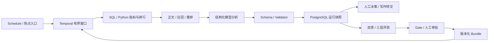

# NewsAgent Agent 优化评审建议

日期：2026-10-03。性质：基于当前工作区代码的设计评审与待实施建议，未修改运行代码、配置、数据库或长期项目上下文。

用户提供的两张图片作为评审问题清单。图片中的 GraphRAG、训练自修复、单证识别等背景不视为 NewsAgent 已有能力，也不视为要求自动执行这些操作。

本次先阅读了迁移后位于 `DemoMD/` 的 `PROJECT_CONTEXT.md`、`TAOTIAN.md`，再检查 `agent/`、`news/` 当前代码。现有背景文档仍有旧目录链接；本报告使用当前目录。不沿用历史测试通过数量，也不据此估计生产完成度。本次未运行 pytest、基础设施端到端测试或企业模型评测。

## 1. 判断与优先级

这些思考可以纳入项目，主要用途是完善执行约束、上下文、证据、评测和资源治理。当前主干已经适合新闻业务：Temporal 控制时序，Python/SQL 计算权威数字，LLM 理解与表达，Schema/Validator 检查输出，人工决定生产变更与对外发布。

下一步先解决可观测、可恢复、可验证的问题，再依据真实评测决定是否增加模型路由、图检索或更多 Agent。企业模型、Embedding、行为/内容接口的合同测试仍是上线前置工作，不能用本地确定性替身证明模型质量。

| 优先级 | 建议 | 直接收益 | 实施边界 |
|---|---|---|---|
| P0 | 统一可信身份；全局、租户、模型路由的资源限额 | 防止入口身份边界不一致和大租户耗尽资源 | 先做网关与内部直连边界验证；生产阈值通过压测确定 |
| P0 | 每次运行的预算台账、每次调用的成本/耗时审计 | 让重试、恢复、并发分支也受同一上限约束 | 超限停止自动执行或转人工；不能跳过 Validator |
| P0 | 热点逐篇持久化检查点与并发 claim | 避免批次后段失败导致前段模型重复计算 | 先冻结聚合、正文、证据和版本，再复用逐篇结果 |
| P0 | 完整的服务端证据版本/来源台账 | 支持重放、更正与引用核验 | news_id 白名单之外，保存 chunk、版本、哈希和原文位置 |
| P0 | 明确评测指标口径与 Gate 的适用范围 | 避免把小样本/引用名单检查当作生产质量证明 | 阈值与指标升级版本化，仍需人审 |
| P1 | 统一 token 预算与证据片段选择 | 保留关键新闻事实，减少无效上下文 | 保持现有业务 Schema；先在构造器内裁剪 |
| P1 | 把 Memory 接到当前原生热点构造链并验证 | 让已有 Memory 能力实际参与热点分析 | 定时任务不能借用任意操作员的个人记忆 |
| P1 | Embedding 入库前去重与版本化缓存 | 减少重复文档的模型费用 | precheck 后仍需事务内 recheck；并发另做单飞 |
| P1 | 事件/时间隔离的 holdout 与整链路评测 | 识别过拟合、检索缺陷和配置回归 | 离线只保存聚合快照与证据引用 |
| P1 | 独立新闻的有界并发 | 在可恢复与配额就绪后降低批次耗时 | 写作章节有前文依赖，不能直接整体并行 |
| P2 | 按风险与任务路由大小模型 | 在质量门槛相同的条件下降低单位合格报告成本 | 先静态规则，升级次数与费用有上限 |
| P2 | 多跳专题的图检索试验 | 帮助跨报道关系与时间线研究 | Python 自有实现；不新增外部 Agent/知识库框架运行时 |

这里 P0 表示进入企业联调或扩大并发前应补齐的机制，P1 表示在现有能力上改善质量/效率，P2 表示需要实验数据证明收益后再决定。

## 2. 现有完整调用链及真实能力边界

### 2.1 热点链路

```text
Temporal Schedule / 热点 API / 同次运行绑定的 SQL 工具入口
→ HotNewsMonitorWorkflow
→ HotNewsActivities.run_hot_news_window
→ ActiveProductionBundleHotNewsService.run：读取租户 Active Bundle
→ HotNewsOrchestrationService.run
  → NewsMetricSource 聚合快照，或 BehaviorDataSource + NewsMetricCalculator
  → 基线查询 → HotNewsRanker
  → HotNewsEnrichmentService：批量正文、关联召回、候选正文补全、确定性重排
  → HotNewsAnalysisInputBuilder：指标、正文片段、RelatedNewsEvidence 白名单
  → NativeHotNewsAnalysisRunner
  → StructuredInferenceService：PromptRegistry、JSON Schema、InferencePort
  → 企业推理接口 / 相同 Port 的隔离本地实现
  → Pydantic + HotNewsAnalysisValidator
→ PostgresHotNewsRunStore：analysis_runs.result_payload 保存报告与输入快照
→ 查询 API、SSE、人工运营决策、可选写作转交
```

设计文档使用 `EvidencePacket` 一词；当前实际输入类型是 `HotNewsAnalysisInput`、`RelatedNewsEvidence`，没有同名 `EvidencePacket` 类。建议先强化实际输入构造链，避免再建一套重复契约。



图中回流通过独立有界运行与人工审批发生，不表示一个无限执行的模型循环。S3 Artifact 当前主要承载写作和评测产物；热点逐篇 Artifact 是本报告的待建方案。

证据：`app/services/active_bundle_hot_news.py:125`、`app/services/hot_news_orchestration.py:200`、`app/services/hot_news_analysis.py:34`、`app/model_runtime/hot_news.py:58`、`app/model_runtime/core.py:217`、`app/activities/hot_news.py:172`。

### 2.2 写作、知识和反馈链路

| 链路 | 上游、转换与核心逻辑 | 外部依赖与下游 |
|---|---|---|
| 写作 | Jobs API/热点转交 → `NewsWritingWorkflow` → `NewsStepHandler` → Research → 人审 → Outline → 人审 → Section → Assemble → Reviewer → 有界返工 → 终稿人审 | `StructuredAgentClient`/`InferencePort`；PostgreSQL Step/AgentRun、S3 Artifact/哈希、Checkpoint；批准后由 CMS Port 发布 |
| 知识 | 爬虫/图文/视频文本化/QA → `KnowledgeDocument` → 知识 API/`ContentIngestService` → `PostgresKnowledgeStore.upsert_documents` → `split_text` → `EmbeddingPort` → 文档台账/向量投影 | 企业 Embedding；文档版本、租户过滤、关联检索和重排；向量平台生产合同待验收 |
| Data Loop | 运行失败/低置信/人工反馈 → 脱敏 Feedback → 标签独立二审 → `EvaluationDatasetFreezer` → Golden/Fresh/High-risk → `HotNewsOfflineReplayService` → `EvaluationGate` → 人工审批/激活/显式回滚 | 推理接口、PostgreSQL 审批/版本账本、不可变评测 Artifact；目前迭代可控配置，不自动训练模型 |
| Memory | Memory API 写入任务目标/偏好/约束 → 短期记录或长期候选审批 → 作用域过滤与冲突解析 → `MemoryContextApplicationService` → `MemoryPromptInputBuilder` → 模型上下文投影 | PostgreSQL 个人 Memory 与审批；`MemoryAwareHotNewsAnalysisService` 已有实现，但当前 Active Bundle 构造处使用普通 `HotNewsAnalysisService`。热点 Observation/Decision/Outcome 和反馈经验不能视为已接入该个人 Memory |

当前 `build_native_knowledge_search` 只装配 `HOT` 层（`app/model_runtime/knowledge_factory.py:33`）；HOT/WARM/COLD 分层检索领域实现存在，不代表当前原生运行已接通三层生产索引。

## 3. 两张图片逐项映射

| 图片中的问题 | NewsAgent 现状与建议 |
|---|---|
| 图一 1：整体架构、执行流程 | 用第 2 节真实调用链讲清控制、数字、推理、人审和存储；无需为了称为 Agent 改成无界自主规划 |
| 图一 2：为什么串行、并行有什么问题 | 数据/基线/排行/正文/检索/分析存在依赖；独立新闻可并行，前提是冻结输入、配额、逐篇检查点与稳定归并 |
| 图一 3：避免循环 | 已有 Workflow、重试、审核轮数上限；补全局预算、跨恢复累计、无进展判定和明确停止原因 |
| 图一 4：多层上下文共享 | 已通过结构化输入、Artifact 引用、前文章节摘要共享；补每次调用的统一 Context Manifest 与版本/哈希 |
| 图一 5：何时压缩、压缩顺序 | 当前主要是字符截断；每次组装后、发送前按目标模型 token 预算检查，先去重/选片，再裁历史和低相关证据 |
| 图一 6：工具调用次数、循环轮数 | 当前热点是固定 Python 编排，不能编造自主工具轮数；正常 N 篇有 N 次分析推理，重试详见第 4 节 |
| 图一 7：租户隔离、并发限制 | 已有租户查询/网关 Principal；入口鉴权一致性、跨 Worker 配额、公平调度仍需补齐与企业验证 |
| 图二 2：Function Calling、MCP、Skill | 分别是模型提出结构化动作、工具接入协议、任务操作约定；权限和执行仍由 Python/Workflow 控制，不需要同时引入三者 |
| 图二 3：大返回结果、缓存 | 用摘要/分页/聚合/证据引用，原产物在获授权服务端保存；缓存键包含租户/权限范围/内容与索引版本，企业行为只保存必要聚合 |
| 图二 4：成本与耗时 | 有部分 token/时间字段，缺完整计费；统一覆盖推理、Embedding、重试、SQL/RPC、索引和基础设施摊销，区分实际与估计 |
| 图二 5：压缩、为什么 GraphRAG | 压缩先独立解决；图检索适合多跳关系/全局主题研究，不是 token 压缩的必选技术 |
| 图二 6：图谱/人工编辑错误兜底 | 当前未实现图谱；未来关系必须带原始证据、来源版本、生效时间和审核状态，可隔离撤销、重建投影 |
| 图二 7：子图超预算 | 若试验图检索，用租户/时间/任务约束、有限跳数、节点/边配额和来源多样性裁剪，最终仍回到文本证据与统一 token 预算 |
| 图二 8：训练自修复、自动白名单/人工建议 | 当前无训练服务；映射为索引任务和实验运行恢复，仅对可重试、幂等且获授权操作自动修复，生产改动仍人审 |
| 图二 9：单证准确率、错误归因 | 项目没有单证识别；映射为新闻实体/数值/引用、视频 ASR/文本化错误，按取数/检索/裁剪/推理/校验/人工标签分层归因 |
| 图二 10：固定评测过拟合、泛化 | 已有三层集合；补事件分组与时间 holdout、来源隔离、隐藏最终评测集及持续抽样，不拿 Fresh bad case 当线上总体准确率 |
| 图二 11：更新集合、覆盖分布 | 保留稳定 Golden，滚动 Fresh，累积 High-risk；新增未见事件、来源、领域、语言、图文/视频、长尾/突发、数据缺失与注入攻击分层 |
| 图二 12：多模型降本、错路由 | 当前是场景/Bundle 静态绑定与 allowlist；先按风险确定性路由，再做最多一次获批升级，统一校验与预算 |
| 图二 13：多 Agent 的问题 | 共享错误证据、职责重叠、上下文重复、状态竞争、长尾延迟、意见冲突、成本放大；保留现有角色，用消融实验决定新增角色 |

## 4. 执行、调用次数和串并行

### 4.1 当前次数要分清三个口径

1. **业务步骤数**：Python Port/Activity 调用，不等于网络请求数。
2. **模型尝试数**：推理/Embedding 的实际请求，包括失败、超时和重试。
3. **业务迭代轮数**：Reviewer 返工、人工恢复、候选实验等，不能与网络重试相乘后随意报告。

热点默认 `ranking_limit=20`，但配置对象只检查其大于零，不能把 20 称为不可突破的全局硬上限。正常成功且没有完整结果复用时，N 篇待分析新闻有 N 次分析推理；完整运行复用时跳过分析。知识查询会有额外 Embedding，SQL 工具入口可能有 intent 推理，不能混在 N 中忽略。

`HotNewsMonitorWorkflow` 配置最多 **2 次 Activity 尝试，即首次执行加 1 次重试**，单次 45 分钟、合计 90 分钟。当前整批运行完成后才 `save_completed`，没有逐篇 durable checkpoint，普通链路重试还会重新取数/检索。因此在 policy 的排行上限 L 保持一致时，单个该 Workflow 的应用层分析尝试上界是 2L（默认最多 40），只有两次新闻集合相同时才能简写为 2N。企业模型是否兑现 HTTP `Idempotency-Key` 的去重和免重复计费尚未验收。外部 Adapter 内部重试、不同 Workflow 并发、人工重启另计，不能据此宣称总费用也被 2N 覆盖。

写作正常 n 章节、首轮审核通过、无人工返工时，模型调用是 **n+4**：Research、Outline、n 次 Section、Assemble、Review。Finalize 复制既有 draft，不调用 LLM（`app/services/news_step_handler.py:248`）。审核最多 **3 轮**，普通 Activity 最多 3 attempts；Checkpoint 还有业务重试规则，二者不是简单的 3×3。

写作 `ArticleOutline.sections` 当前没有 `max_length`，所以“3 轮审核”尚不能给出总调用量绝对上限（`app/schemas/writing.py:26`）。此外，第三轮仍返回 rewrite 时，Workflow 会再改写和 Assemble，随后转人工，没有第四轮自动 Review（`app/workflows/news_writing.py:174`、`:215`、`:233`）。建议最后一轮改成明确的人工作业交接，或在自动返工前停止，避免未经下一轮审核的额外计算。

写作人工 Gate 当前 `wait_condition` 没有等待超时（`app/workflows/news_writing.py:289`），与 Data Loop 的 48 小时默认拒绝不同。建议补任务有效期、过期撤销/转人工和明确的不发布默认行为；超过有效期的批准不能自动发布过时稿件。

### 4.2 建议补统一运行预算

新增概念 `RunBudget`，由 Python 管理，按 `tenant_id + run_id` 持久化。它是建议对象，当前尚未实现。

| 预算项 | 用途 |
|---|---|
| 最大章节/待分析新闻/候选数量 | 约束业务输入规模 |
| 最大推理、Embedding、工具请求次数 | 约束总调用量，包含所有 attempts |
| 最大审核/检索扩展/模型升级次数 | 约束业务迭代 |
| 最大输入/输出 token 与累计成本 | 约束单次请求和整次任务费用 |
| 总截止时间、单阶段超时、排队时间 | 区分执行慢与资源等待 |
| 最大无进展轮数 | 同输入、同证据、同产物反复出现时停止 |

在发起请求前原子预留次数与额度，结束后结算；超时且计费未知时保留预留或标记待对账。Activity 重试、人工 resume 和并发分支继承同一本台账，不能每次清零。系统终止、转人工、取消、预算耗尽、无进展应有不同状态/错误码与最后一个成功检查点。

无进展指纹使用冻结的任务目标、规范化工具参数、有效证据内容哈希和执行版本，排除每次变化的 trace/timestamp。正常限时重试仍允许；已批准的新窗口或内容更新会产生新的输入指纹。副作用未知的调用先查询外部状态，不能只凭“没有返回成功”再次提交。

### 4.3 热点逐篇检查点先于并发

建议调用链：

```text
窗口 claim → 冻结 Bundle/聚合快照/基线/正文版本/证据/上下文清单
→ 对每篇 news_id 原子 claim
→ 读取已通过校验的逐篇 Artifact，或执行推理和 Validator
→ 保存输入哈希、输出、模型版本、attempt 与成本
→ 全部达到本次运行的完成策略后按原 rank 归并
→ 保存运行摘要 → 现有查询/SSE/反馈
```

逐篇键至少绑定租户、窗口运行、news_id、Bundle、正文/证据版本与上下文内容哈希；不能只按标题或模型 request_id 去重。租约到期不代表旧执行必然停止，应使用 fencing/version 防止迟到结果覆盖当前结果。

先保持当前整批成功语义。若后续允许 partial success，要另行定义 Schema、API 和反馈语义，不能把部分成功冒充完整榜单分析。

### 4.4 并行范围与资源隔离

| 环节 | 建议 | 原因 |
|---|---|---|
| 聚合 → 基线/排行 → 正文/召回 → 分析 | 保留依赖顺序 | 下游依赖上游的 news_id、数字和查询信息 |
| 同窗口不同新闻的模型分析 | 小规模有界并行，容量测试后配置 | 共享冻结 Bundle，但输出可独立检查；按 rank 稳定归并 |
| 同次检索的查询/索引层 | 现有有限并行继续使用，补跨运行限额 | `tiered_vector.py` 已使用 semaphore/gather，不能描述成全部串行 |
| 逐章节写作 | 先串行；只有独立且无前文依赖的章节再分组并行 | 当前输入有 `previous_sections_summary`，并行会改变内容一致性 |
| Artifact/账本提交、晋升、发布 | 原子、幂等且经过对应门禁 | 防止覆盖、重复生效与越过审批 |

当前检索默认 query 并发 8。若实际装配三层索引，一个 query 内还有三层 gather，单 batch 可产生最多 24 个索引请求；当前原生 HOT 装配不会产生这个三层倍数。许可是在每个 batch 内创建，跨 batch/Worker/租户不共享。Data Loop 的 semaphore 也限定单次 replay，不是全系统配额。

补充全局模型路由配额、每租户并发/速率/token 日预算、队列公平性和每租户 SQL/索引资源限制。分布式 semaphore/令牌桶应带租约与故障释放；高优先级业务也不能突破企业服务容量。一个大租户压满资源时，其他租户仍应能在约定排队时限内完成。

身份方面，HotNews/Data Loop/Memory 已校验可信网关凭据与 Principal；写作 Jobs/Events 的 `get_tenant_id` 仍直接读取 `X-Tenant-ID`（`app/api/dependencies.py:540`）。数据库查询有 tenant 条件，但 tenant 字段本身不构成鉴权。建议统一入口 Principal，并验证网关清除用户伪造头、阻止绕过网关直连、最小权限与凭据轮换。这里是待验证边界，不能据代码单方面断言部署中已经发生越权。

## 5. 上下文、工具结果与缓存

### 5.1 上下文分层与共享

| 层 | 保存什么 | 共享方式 | 裁剪规则 |
|---|---|---|---|
| 可信指令层 | 已批准 Prompt、Schema、权限约束、任务目标 | PromptRegistry/冻结 Bundle | 不让外部文本或总结改写 |
| 任务事实层 | 租户、窗口、指标、news_id、正文版本、原文引用 | PostgreSQL 快照 + Context Manifest | 权威数字保持精确，证据保留身份/出处 |
| 阶段工作层 | 当前报告、提纲、章节摘要、返工指令 | 类型化 Artifact 与哈希引用 | 只装载本步骤需要的片段 |
| 历史经验层 | 当前个人 Memory；建议另接历史决策与获批经验 | 按作用域、任务、时间检索 | 只选有关且在有效期内的内容，个人记忆不默认共享 |

现有写作 Workflow 已传 Artifact 引用，Handler 按哈希读取，再提取前文摘要；这比共享全部对话历史更合适。建议添加服务端 Context Manifest，记录当前调用实际使用的快照、新闻/chunk/version、Memory ID/version、裁剪原因、token 估计方法与 Prompt/模型版本。它不是共享可变聊天记录，也不是新的权威事实源。

当前证据还有一个血缘缺口：向量命中携带 content/embedding version 与 chunk_id，但转换为 `RelatedNews` 时未完整保留版本；转为 `RelatedNewsEvidence` 后也没有 chunk/version 字段（`app/retrieval/tiered_vector.py:259`、`app/schemas/hot_news.py:70`）。news_id 合法不等于原文支持结论。建议先在服务端证据台账保留 document/chunk、版本/哈希、原文 span、取回时间、授权范围与检索策略，模型继续使用现有小型 Schema 投影。裁剪后更新可引用集合，不留下已移除来源的引用；需要扩展业务 Schema 时另建版本。

Memory 接通时应冻结本次选择结果。定时监控没有自然个人 user_id，建议另行明确获授权的租户/团队经验接口，不能简单去掉当前个人 Memory 的 user_id 条件实现共享；人工触发可以在权限范围内选择个人偏好。冲突、高风险或失效记忆需保留审计，不得把历史模型总结提升成事实，或让 Memory 修改数字和发布权限。

### 5.2 何时压缩，优先压缩什么

现有正文、摘要和每条证据最多 2,000 字符，证据最多 5 条；Memory 最多 20 项，单项 value 超过 1,000 字符时整项跳过。它们提供大小护栏，但不是目标模型 token 预算（`app/services/hot_news_analysis.py:66`、`app/services/memory_prompt.py:25`）。

建议每次模型请求组装后、发送前执行预算检查，目标模型切换后重新计算：

```text
实际序列化输入 token ≤ 模型上下文上限 − 预留输出 − 未计入的协议开销 − 安全余量
```

实际输入计数包含系统 Prompt、JSON 键、Schema、Memory、证据及可能的工具说明，Schema 只计一次；右侧仅扣尚未被该计数覆盖的协议开销。优先使用企业接口确认的 tokenizer/计数能力；不能获得精确计数时用保守估计并注明方法，事后与服务端 usage 对账。中文字符数不能直接等同 token 数。

压缩顺序：

1. 去掉重复转载、重复片段、HTML 噪声和无关字段。
2. 从正文选取与任务有关的句段，保留事实主体、时间、否定/更正、权威数字与相邻语境；不再只截文章开头。
3. 缩减过时的章节/工具历史，只保留阶段摘要与 Artifact 引用。
4. 删除低相关且缺独立信息的证据，保留关键支持和反驳证据、来源多样性与时间先后。
5. 缩减非必要 Memory；总结必须带来源与版本，可回查原始授权内容。
6. 必要事实和关键证据仍放不下时，拒绝这次请求或转分阶段研究，并明确证据不足。

不压缩租户权限、审批规则、输入身份、权威指标及关键引用关系。若生成式摘要用于压缩，其内容仍不可信；不能只验证摘要中出现的数字而忽略遗漏了否定/纠正信息。应记录保留/遗漏项，并把压缩策略作为独立评测变量。

### 5.3 工具大结果与缓存

SQL/RPC 返回按用途投影字段、服务端聚合、限制行数并分页；模型只拿摘要、代表样本、结果引用、时间戳和必要证据。新闻/报告的授权原始内容可放文档台账或 Artifact；企业用户行为明细不能通过“大结果落盘”变相进入本地。

| 缓存 | 建议 key 与失效条件 |
|---|---|
| 正文/片段 | tenant、news_id、content_version/content_hash、解析/切片策略版本；更正/撤回立即失效 |
| Embedding | tenant、规范化文本哈希、Embedding route/version/dimension、预处理/切片版本；版本变更重建 |
| 检索 | tenant、权限范围/授权版本、查询哈希、过滤器、index_revision、Embedding/rerank 版本；索引更新/权限变化失效 |
| 聚合/SQL 结果 | tenant、授权范围、规范化参数、窗口、watermark/快照版本、SQL/契约版本；未完成窗口与完整窗口分别处理 |
| 模型产物复用 | 冻结运行输入哈希、Bundle/模型/Prompt/Schema/Validator 版本；通过检查点与审计复用 |

PostgreSQL 继续是事实源，Redis 只做加速/事件，向量与可选图索引继续是可重建投影。TTL 是时效策略，不替代版本化和权限检查。共享热点缓存需显式公共数据授权，默认租户命名空间隔离。

这些是待建的 Agent 缓存方案。现有爬虫 `ArticleCache` 主要按公共新闻 URL 缓存，不能证明检索/模型缓存已接通，也不能直接复用于私有企业内容。

一个已经定位的降本点：`PostgresKnowledgeStore.upsert_documents` 在 `:149–170` 先切片/Embedding，`:174–194` 才检查相同版本是否应 SKIPPED。同内容重复写入虽不重复保存，仍会调用 Embedding。建议模型调用前做轻量 precheck，保留事务内 recheck；并发请求再用租户/文档/版本 claim 或单飞。还需包含切片策略版本，避免策略变更后错误复用旧向量。

## 6. Function Calling、MCP、Skill 与多 Agent

Function Calling 是让模型提出类型化动作与参数的一种接口；MCP 是客户端/主机/服务端之间接入能力的协议；Skill 是任务操作约定和说明。三者都不自动提供业务权限或安全执行。MCP 的接入职责与隔离边界可参考[官方架构说明](https://modelcontextprotocol.io/docs/learn/architecture)。

当前热点原生 Runner 没有动态 tools 调度循环：模型通过 `InferencePort` 返回 JSON，工具/RPC 调用由 Python 预编排。适合保留这个主干。若专题研究确实需要动态补查，可由模型返回受限 `ResearchPlan` 候选，Workflow 验证后执行白名单只读检索；不能让正文中的“指令”调用 SQL、修改 Memory 或发布内容。

建议将可用工具的输入/输出 Schema、授权作用域、超时、最大结果量、幂等语义、是否有副作用、是否可并行、结果可信等级放入 Python 注册表。Skill/操作说明作为已批准、版本化的静态资产；不能让检索返回的 `SKILL.md` 成为可信指令。只有出现跨系统接入或对外工具复用需求时，再加 MCP Adapter，底层仍是现有 Python Port。

现有 Research/Writer/Reviewer/ErrorAttribution 分工可以保留。新增 Agent 前应做单角色/多角色消融实验，比较独立事实支持、错误率、延迟和成本。多个模型基于同一份错误证据得出一致结论，并不等于独立验证；最终事实约束仍由证据、确定性校验和人工复核提供。

多 Agent 主要问题与约束：上下文复制增加费用，用只读最小输入；共享状态发生竞争，用唯一写入者/原子提交；修改彼此产物导致循环，用有界阶段与进展指纹；结论矛盾保留冲突而非多数投票；并行长尾超时按截止时间和完整性要求处理；模型自报 confidence 不能直接作为准确率或自动晋升依据。固定流程与自主 Agent 的区别、独立子任务并行模式可参考[Anthropic 的工程说明](https://www.anthropic.com/engineering/building-effective-agents)。

## 7. GraphRAG 与图错误兜底：按需试验

当前关联检索已经结合正文、向量、实体/事件/关键词/时间等业务规则；特征虽有数值抽取，当前重排不使用 numbers 评分。建议先衡量现有 Recall@k、同事件混淆、重排与片段质量。项目不需要因为图片问到 GraphRAG 就替换检索主干。

容量问题也需先独立处理：当前原生 PostgreSQL 检索将受过滤的向量取到 Python 点积排序，默认允许最多 50,000 条参与扫描，通过读取第 50,001 条检测超限并报错（`app/knowledge/postgres_store.py:253`）。这不是已验收的生产 ANN/百万级能力。先完成既有生产向量 Adapter、延迟/容量/恢复验证，再比较可选图检索收益。

图检索适合试验的真实问题包括：同一事件跨天时间线、人物/机构的多跳关联、报道之间的引用或回应、多个事件的共同背景。微软 GraphRAG 的 local search 结合实体关系与文本片段，global search 面向全局社区报告；这说明其用途不等于单纯压缩上下文。参见[官方 Query Engine 说明](https://microsoft.github.io/graphrag/query/overview/)。结合 NewsAgent 当前局部关联新闻任务，暂缓引入完整图索引是本次评审的架构判断。

若验证有收益，以 Python 构建 `news/entity/event/claim` 及关系的可重建投影，不新增外部 Agent/知识库框架运行时。先用 PostgreSQL 关系表和受限遍历即可，图存储不是前置条件。

每条关系建议记录：租户/权限、关系类型、两端 ID、来源 news/chunk/version/hash、原文位置、有效时间、抽取器/Prompt 版本、置信、机器候选/人审状态。共现不能直接变为因果，重排相似不能直接变为同事件。必须能区分原文陈述、模型推断与人工批准。

错误发现包括 Schema/身份/时间校验、来源撤回/更正、冲突关系检测、相似事件误合并回归及分层人工抽检。人工编辑也做版本化 diff、审批与审计。错误关系隔离后使相关缓存/投影失效，依据文档台账重建；图不可用时回退已授权的文本/向量证据并声明局限，不能绕过既有 Validator。生产配置回滚仍是显式获批操作。

子图裁剪先过滤租户/权限/时间和任务范围，再限制跳数、节点、边、每实体扩展与单源占比。按问题相关、来源独立性、时效和证据覆盖选择，保留冲突/更正，最后取可引用文本片段进入第 5 节的 token 预算。关键路径超预算时转分阶段专题研究或声明不足，不能悄悄删除反证后生成确定结论。

## 8. 错误归因、自动恢复与泛化评测

### 8.1 用 TAOTIAN 原则完善当前闭环

可迁移原则是数据回流、分层失败策略、幂等/限次、跨天台账、双基准、人工决策。NewsAgent 的迭代对象是 Prompt、模型路由、检索/热度规则与校验器；不能照搬电商训练提交和自动 Reward 生效权限。

自动恢复只覆盖经验证的低风险动作：带稳定键的只读 RPC 暂时错误、可确认状态的索引重建/重新投影、可重复的 Artifact 拉取。数据/权限/Schema/冻结版本错误硬阻塞；Prompt 修改、标签批准、模型切换、热度规则、发布和生产激活由对应人工 Gate 决定。成功标准是确定性不变量及下游产物完整性恢复，不是进程退出码为零或 LLM 自称修好。

建议为恢复动作维护 allowlist、参数范围、次数上限、验证条件、回退/隔离方式和人工升级条件。超时副作用未知先对账；不通过改请求 ID 反复提交来“修复”。本项目尚无训练任务服务，相关讨论仅作为未来合同设计，不创建自动训练路径。

### 8.2 错误归因先看证据层，再看模型

```text
失败/人工纠错
→ 固定 run、Bundle、数据/正文/检索/上下文/模型版本
→ 确定性检查分层错误
→ ErrorAttributionAgent 解释证据并提出候选原因
→ 人工确认重要标签
→ 最小变量对比实验
→ 冻结评测、Gate、人工决定
→ Outcome/Approved Experience，供后续增量分析
```

建议分类：取数/窗口/watermark、指标/基线、正文缺失/版本错、未召回、重排误判、裁剪丢事实、模型幻觉/错误因果、结构/引用校验、ASR/视频语义、人工作业标签、权限/资源错误。模型输出归因是假设，须用回放和受控替换验证。先固定证据对比 Prompt，再固定 Prompt 对比召回/裁剪，避免同时改多个变量后无法归因。

图片的“单证识别准确率”不适用于本项目；应分别量化实体/数值匹配、引用支持、同事件识别、转写关键事实错误、热点解释与建议质量，不合成一个无定义的总体准确率。

### 8.3 现有评测有基础，也有严格边界

已有标签二审、cutoff 冻结、不可变 manifest、三层集合、当前/候选/可选上一实验回放、确定性 Gate 与人工激活。双基准强制与否由所选 Gate policy 决定，不能宣称每次都必然包含上一实验。

三个应优先处理的实际问题：

1. `EvaluationGatePolicyRegistry` 当前三个 cohort 的 `min_case_count` 都是 1（`app/services/data_loop/step_handler.py:52`），不足以作为生产泛化证据。新增生产 policy，按重要分层覆盖量、错误风险与统计不确定性制定门槛，不静默修改历史 policy。
2. `evidence_precision` 目前是“未出现 forbidden 引用的 case 占比”（`app/services/data_loop/offline_replay.py:228`），不是逐引用真实支持精确率。contract-invalid case 的 forbidden 计数为零也可能进入这个 clean 分子；critical failures 会另行阻断 Gate，但名字会误导监控。应版本化更名/拆分为名单合规率、引用支持精确率、必要证据覆盖率，并定义空引用/非法输出的分母。
3. 当前 replay 固定 `analysis_input`，原生 registry 主动拒绝本地执行资产变化（`app/model_runtime/bundle_runtime.py:110`）。它可比较受支持的分析 Prompt/模型配置，不能替代指标、排行、Schema/Validator、Memory 或检索规则变化的整链路评测。这是已有的保护边界，应保留。

### 8.4 防止固定集合过拟合

保留当前三层，但明确职责：Golden 看稳定回归；Fresh bad case 看近期已知问题改善；High-risk 看严重错误。它们都可能偏离生产分布，不能只凭分数提升宣称线上总体质量提高。

另设从未参与调参的时间 holdout，并按同一事件、转载/近重复内容、来源分组，保证同事件不同 news_id 不跨优化集和最终评测集。尽量覆盖未见领域/来源和未来时间段。最终 holdout 不进入候选生成和 Memory，不反复泄露逐条答案；暴露后迁移为开发集，再创建新 holdout。数据集标明版本、切分/采样策略和泄漏检测结果。

更新覆盖分布：业务领域、长尾/突发、来源与权威等级、文章/视频、中文/混合语言、长正文、窗口/基线缺失、过期/更正/矛盾证据、同名实体、同题不同事件、租户/权限、注入攻击、限流/超时/恢复。记录各分层样本数与置信区间，不只报告总体平均。

整链路评测建议从授权聚合快照、正文版本与证据引用重放指标/排行/召回/重排/裁剪/分析/Validator，不落企业原始行为。覆盖 Recall@k、同事件准确率、引用真实支持、关键事实保留、数字一致性、拒绝/局限是否合理、重大失败及成本/P95 耗时。检索/规则变更先跑这套，再走现有候选和人审链。影子/小流量验证也须在获批环境和配额内执行。

## 9. 成本、耗时和模型路由

已有写作 AgentRun 的开始/结束时间与 prompt/completion tokens，评测阶段有开始/结束时间，热点成功报告可保存 usage。`cost_amount` 字段存在，但当前未发现计费计算/赋值；EmbeddingResult 没有 usage；热点监控主要是完成/复用/失败计数（`app/observability/hot_news.py`）。因此不能说“已经完整统计费用”，也不能说“完全没有时间/token 记录”。

建议每次 attempt 保存：tenant/run/step/trace、业务幂等键、provider request_id、实际 route/version、Prompt/Bundle、输入/输出/缓存 token、Embedding 文本量、队列/网络/执行时间、超时/重试状态、实际计费或估计金额、费率版本、计量来源。敏感正文、原始行为和凭据不进入遥测。高基数 run/news_id 放 trace/审计，不放 Prometheus 标签。

```text
可归属总成本 = 推理费用 + Embedding/重排等服务费用
             + 业务数据/检索调用费用 + 存储/索引/网络/计算摊销
单位合格报告成本 = 同范围全部尝试成本 / 通过定义质量门槛的报告数
```

内部模型若按 token 结算，费用中已经包含的模型算力不能再重复计入；自托管时单列 GPU/CPU 资源与利用率。未知失败计费标记 unknown/待对账，而非记零。比较串并行时用端到端关键路径耗时，不能把重叠的子调用时间相加当用户等待时间。线上、批量知识入库、实验评测分别核算，包含失败与废弃实验。

当前模型选择是场景/Bundle 静态绑定、allowlist 和响应模型核验，尚无动态小模型→大模型升级（`app/model_runtime/http.py:117`、`:162`）。建议先用确定性场景/风险规则：数字仍由 SQL/Python，常规解释用经过验收的经济模型，证据冲突/多跳研究/高风险输出用批准的更强模型或人工。小模型输出也过同一 Schema/Validator；失败/不足只有在错误类别允许时升级一次，仍不得突破 run budget。不能信任模型自报 confidence 作唯一路由条件。

是否降本须计算：首次推理、误路由、升级、重试、路由本身和复核的总成本，在质量/覆盖门槛相同、holdout 不退化时比较单位合格报告成本。更大模型不能修复取数/权限/错误证据，不应盲目升级。

## 10. 落地顺序、配置与验收入口

以下是建议任务，不是已完成实现。新增预算/上下文/配额/路由等策略应版本化并绑定部署或 Bundle 运行快照；涉及生产行为和门槛的变更走已有审批。维持既有业务 Schema，确需扩展时另建版本与迁移。

| 任务 | 现有接入位置 | 建议配置项（未实现） | 复用测试入口及新增验收 |
|---|---|---|---|
| 企业模型/Embedding 合同、预算/遥测 | `model_runtime/core.py`、`http.py`、`config_file.py`、`observability/` | scene 单次 token、累计调用/费用、截止时间、费率版本 | `tests/test_model_runtime_config_and_http.py`、`test_model_runtime_core.py`；测 usage 缺失、超时未知计费、retry/resume 累计与预算原子性 |
| 统一身份和租户配额 | `api/dependencies.py`、各入口、Worker/Adapter | 全局/route/tenant 并发、速率/token 限额、队列规则 | `test_hot_news_api.py`、`test_jobs_api.py`、`test_event_reader.py`；测伪造头/直连拒绝、多 Worker 与大小租户公平性 |
| 热点逐篇检查点 | `activities/hot_news.py`、`services/hot_news_orchestration.py`、`hot_news_run_store.py` | checkpoint/lease 策略版本，完整性规则 | `test_hot_news_activity.py`、`test_hot_news_run_identity.py`、`test_hot_news_fault_drill.py`；第 k 篇失败、落库失败、并发同键、迟到写入，只补未完成篇 |
| 写作绝对预算与末轮处理 | `workflows/news_writing.py`、`schemas/writing.py`、Checkpoint/Recovery | 最大章节/总调用/审核轮数、Gate 有效期与末轮转人工规则 | `test_temporal_orchestration.py`、`test_news_step_handler.py`、`test_recovery_service.py`；新增章节超限、第三轮返工与过期批准用例 |
| token 预算、上下文/Memory 接通 | `hot_news_analysis.py`、`memory_prompt.py`、`active_bundle_hot_news.py` | context_policy/tokenizer 版本、证据/Memory 配额 | `test_memory_aware_hot_news_analysis.py`、`test_memory_prompt.py`、`test_active_bundle_hot_news.py`；补当前装配链 E2E、定时作用域、超预算、反证/更正保留 |
| Embedding precheck/缓存 | `knowledge/postgres_store.py`、`model_runtime/query_embedding.py`、检索 Adapter | 切片/index_revision/缓存策略版本、租户命名空间 | `test_native_knowledge_indexing.py`、`test_tiered_vector_retrieval.py`；同版本相同内容零新增 embed、并发单飞、版本更新重建、跨租户不复用 |
| 指标/holdout/整链路评测 | `data_loop/offline_replay.py`、`dataset_freezer.py`、`evaluation/hot_news.py`、Gate registry | 新生产 Gate、最小分层覆盖、切分/采样/指标版本 | `test_offline_replay.py`、`test_dataset_freezer.py`、`test_evaluation_gate.py`；非法/空引用口径、事件无泄漏、支持范围拒绝与整链路规则回归 |
| 有界并发/模型路由/可选图检索 | 各 Workflow 的受限 Activity/Port、检索模块 | concurrency、route policy、最大升级/跳数/子图与 token 预算 | 新增压测和消融实验；必须同时报告质量、P95、全部 attempts 成本、资源上限与回退行为 |

当前可确认的配置入口是 `MODEL_RUNTIME_BACKEND=native`、`MODEL_RUNTIME_CONFIG_PATH`、`HOT_NEWS_RUNTIME_MANIFEST_JSON`、`HOT_NEWS_SCHEDULE_DEFINITIONS_JSON`、`DATA_LOOP_REPLAY_MAX_CONCURRENCY`、`DATA_LOOP_MAX_CASES_PER_COHORT`、`TEXT2SQL_MAX_ROWS`、`TEXT2SQL_TIMEOUT_MS`。本报告没有新增配置项，没有读取 `.env`。认证与企业凭据继续由既有 Secret/网关注入。

建议第一批只实现身份/预算、逐篇检查点、证据血缘、费用遥测和评测口径；第二批接通 Memory、优化片段/token 与 Embedding 去重、建立 holdout；第三批根据测量结果增加并发和模型路由。GraphRAG、更多 Agent 与训练能力保留为条件性 TODO。

未完成 TODO：本报告全部实现建议；企业真实接口合同与模型质量；生产网关/配额与索引恢复/容量；计费语义；CMS 幂等发布语义；持久检查点迁移和端到端故障验收；独立 holdout、整链路规则评测及新增策略审批。本地结构正确与测试替身通过，不能替代这些验收。
