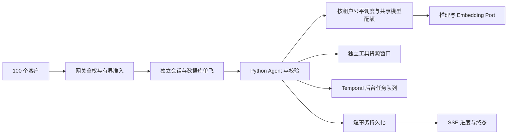

# 100 用户并发：实测与设计

后续多租户实现与验收以[多租户并发设计稿 v2](multi-tenant-concurrency-design.md)为
进一步讨论基准。下方实测是单租户100用户，不能视为多租户公平性或生产鉴权验收。
v2重新明确了排队台账、两层公平调度、共享配额和外部调用未知状态；尚未实现。

测试日期：2026-10-09（北京时间）。结论：当前能建立 100 个并发聊天 SSE 请求，但这次
真实模型测试仅 66/100 完成，尚不能宣称稳定支持 100 个同时活跃的客户。

## 测试结果

在已运行的 `news-agent-model-demo-api-1` 内发起 HTTP 请求，目标为隔离 Compose 的
`http://api:8000`（宿主映射 `127.0.0.1:28000`）。运行时返回
`openai_compatible / glm-5.3-flash`，Prompt 为
`compatible-conversation-v2-query-errors-v2`。未加载 `.env`、改动模型配置或重启服务。
这些数字属于已部署镜像和当时接口状态，不证明当前未提交工作区代码、企业正式模型或
生产部署的容量。

每轮先创建独立合成用户及会话，创建过程不计入并发延迟；随后用一个客户端起跑屏障
同时提交消息，每用户一个请求。半数发送“你好”，半数明确要求使用 `list_hot_news` /
`read_hot_news` 读取已完成报告。用户只有 `hot-news:read` 权限，不启动新 Workflow。

| 指标 | 10 用户基线 | 100 用户突发 |
| --- | ---: | ---: |
| 客户端同时在途峰值 | 10 | 100 |
| HTTP 200 | 10/10 | 100/100 |
| completed 且没有失败/拒绝工具 | 10/10 | 66/100 |
| model_unavailable | 0 | 34 |
| 首个 SSE 事件 P95 | 0.032 秒 | 0.794 秒 |
| 成功轮次总耗时 P50 | 2.337 秒 | 6.757 秒 |
| 成功轮次总耗时 P95 | 10.108 秒 | 11.097 秒 |
| 整轮突发耗时 | 10.109 秒 | 12.222 秒 |
| 历史完全一致 / 终态重放一致 | 各 10/10 | 各 100/100 |
| 其他用户 / 其他租户读取被拒绝 | 各 10/10 | 各 100/100 |

100 用户中，普通对话成功 29/50，已有报告读取成功 37/50。失败也持久保存，所以历史
检查通过不代表业务成功。SSE 建立后业务失败仍可返回 HTTP 200，必须读取 `done.turn.status`
和工具轨迹。首个事件表示受理进度；答复经过校验和保存才发送，不能把它当作模型原始 token
的 TTFT。报告中的 `first_answer_seconds` 包含失败解释文本，应与成功轮次延迟分别理解。

脱敏完整结果：

- `evaluation/results/conversation-load-10-existing-reports-20261009.json`
- `evaluation/results/conversation-load-100-existing-reports-20261009.json`

首次诊断使用“查看最近热点”，10 用户轮次均 completed，但其中 5 个工具被拒绝；100 用户
64 completed / 36 model_unavailable，其中 31 个 completed 轮次工具被拒绝。模型把部分请求
理解为新建查询，READ 权限正确阻止执行。保留原始 `conversation-load-{10,100}-20261009.json`
作为诊断对照，不能把这组 completed 数当作完整业务成功率。

两次 100 用户突发都出现模型入口失败，值得优先检查模型侧容量及适配器。当前
`ModelTransportError` 将 HTTP 错误、超时、连接错误和部分响应格式错误统一映射成
`model_unavailable`，现有报告无法证明是供应商 429。没有采集服务端 CPU、内存、数据库
连接等待或模型侧实际同时执行数，不能据此给出可靠瓶颈归因或容量上限。

## 复现入口与完整调用链

已安装项目依赖的 Python 环境中，从 `agent/` 执行：

```sh
python tools/conversation_load.py --users 100 --transport sse --workload mixed --output evaluation/results/conversation-load-new.json
python -m pytest tests/test_conversation_load.py -q
```

本次宿主的 `agent/.venv` 未安装 HTTPX，使用演示容器已有依赖执行：

```sh
docker exec -i news-agent-model-demo-api-1 python - --base-url http://api:8000 --users 100 --output /tmp/conversation-load-new.json < agent/tools/conversation_load.py
docker exec news-agent-model-demo-api-1 cat /tmp/conversation-load-new.json > agent/evaluation/results/conversation-load-new.json
```

第二组命令从仓库根目录运行。容器名以实际演示项目为准；`api:8000` 必须属于隔离演示
网络。真实模型会消耗调用额度。报告保留合成输入及脱敏指标，不保存模型正文、企业行为
数据或令牌。新建的测试会话与历史保留供审查，不删除已有记录。

完整链路：

```text
CLI main（参数边界与演示目标限制）
→ run（runtime 读取、合成 user UUID、逐个创建独立会话）
→ asyncio.Event 起跑屏障 → send（JSON 或 SSE 请求、端到端计时）
→ /api/v1/conversations/{id}/messages[/stream]
→ 网关 token/tenant/user/READ 权限检查
→ PostgresConversationRepository.begin_turn（行锁、请求幂等、同会话单飞）
→ ConversationAgentService.run_turn / LengthBasedContext（历史与上下文预算）
→ NativeStructuredAgentClient → 版本化 Prompt / InferencePort
→ OpenAICompatibleInferenceClient → 外部模型 HTTP 接口
→ ConversationPlan 校验 → ConversationTools → HotNewsQueryService
→ PostgreSQL 已完成报告 → Python 证据/指标投影
→ finish_turn 持久化终态与轨迹 → SSE done.turn / JSON
→ verify（历史逐项比较、同 UUID 终态重放、跨用户/租户 404）
→ distribution（nearest-rank P50/P95/P99）→ 本地 JSON 报告与 CLI 退出码
```

压测脚本依赖标准库和 HTTPX；外部依赖为演示 API、真实 PostgreSQL、当前模型 HTTP
端点和已有报告。客户端连接池按用户数配置，避免压测客户端默认连接数限制掩盖突发。
`--users` 为 1–100；`--rounds` 为 1–20；`--timeout` 为 5–300 秒且包括整个流读取；
`--transport` 为 json/sse；`--workload` 为 greeting/mixed；`--output` 为必填报告路径。
默认只接受宿主演示端口 28000/28030 或 Compose 的 api:8000，使用现有公开本地演示
token 和主演示租户。任一业务/工具/验证失败退出 1，全部通过退出 0。

`tests/test_conversation_load.py` 用 HTTPX MockTransport 验证 JSON/SSE、HTTP 200 中的
业务失败、completed 中的工具拒绝、历史一致、幂等、身份隔离、百分位和目标限制；不调用
真实模型。这是压测工具自身测试，不是生产容量验收。最终测试为 `6 passed`。

## 并发设计：不同层分别设置窗口

100 个在线客户、100 个在途请求和 100 个模型调用是不同容量。多轮 Agent 一轮可能调用
模型多次，历史压缩、知识检索还可能触发额外推理或 Embedding。建议在现有 Python Port
体系中补齐配额，不引入额外 Agent 运行框架。

1. **入口窗口。** API 可保有 100 个连接，但应有有界排队、用户/租户配额和排队超时。
   先做容量准入，再占用会话轮次；已完成的同 UUID 重放应绕过昂贵执行配额。排队
   不可无限等待；满载返回 429/503 和 Retry-After，SSE 页面明确显示排队或受限状态。
   准入与 begin_turn 的竞态仍由数据库单飞兜底，不能只依赖进程内字典。
2. **模型窗口。** 在 InferencePort/EmbeddingPort 外加统一限流层：按 model route 分配
   在途数、RPM 和 TPM，聊天、热点分析、写作、压缩共享总额度且各有保留份额。可从
   10 个模型在途槽开始做实验；10 用户成功只提供起点，不证明 10 槽足够或最优。
   多 API/Worker 副本需要共享配额，单个 asyncio.Semaphore 无法限制整个部署。
   租约要有超时与释放，租户要公平调度；依赖不可用时不能绕过限流。
3. **数据库窗口。** 当前 `Database` 每个实例是 pool_size=20、max_overflow=20，合计
   最多 40 个连接；每个 API 进程和 Worker 的 Database 实例都可能另建连接池。
   扩容前按“所有实例连接上限总和 + 运维余量”核对 PostgreSQL 配额，把池参数和等待
   超时改为配置。沿用每次事务独立 AsyncSession、短事务；模型等待期间不持有数据库
   事务。100 聊天连接不要求 100 条数据库连接。SQLAlchemy 对池上限的定义见
   [官方连接池文档](https://docs.sqlalchemy.org/en/20/core/pooling.html)。
4. **工具窗口。** 当前数据分析进程执行器已有 max_concurrency=2，但它是执行器实例
   级限制。SQL、Milvus、Embedding、数据分析各设独立资源预算，禁止一次请求无界
   fan-out；缓存只可复用确定性共享结果，键包含 tenant、数据窗口/版本和 Bundle，
   不跨用户复用私人会话。模型 HTTP 池要显式配置连接数和 pool timeout，并和模型
   配额一致，见 [HTTPX 资源限制](https://www.python-httpx.org/advanced/resource-limits/)。
5. **后台任务窗口。** 新建热点分析、写作、入库继续使用已有 Temporal 分队列运行，
   不把所有慢任务放在 HTTP 生命周期内。当前热点 Worker 未显式设置 Activity 并发/
   队列速率；应补 Worker slots 和 Task Queue rate 配置，与模型总配额共同约束。
   一个 run 内的 HOT_NEWS_ANALYSIS_MAX_CONCURRENCY 不等于跨 run/Worker 全局限流。
   配置能力见 [Temporal Python Worker API](https://python.temporal.io/temporalio.worker.Worker.html)。
6. **超时和重试窗口。** 当前模型失败最多重试一次，但固定等待 0.1 秒，在大突发时
   容易同步再次冲击。改为受整轮截止时间约束的退避、抖动和 Retry-After；只重试
   明确暂态错误。新建 Workflow/发布等提交继续使用既有幂等键和人工 Gate，不通过
   盲目重试提高表面成功率。排队等待与执行预算分别记录，并保持轮次租约覆盖真实
   执行截止时间，避免迟到结果覆盖 interrupted 终态。

示意目标链路（设计，尚未实现）：



## 待完成验收与 TODO

- 在模型适配器补脱敏错误分类：HTTP status、timeout/connect/pool、route、attempt、
  queue_wait、model_latency、token usage、provider request id；不记录密钥/原始 Prompt。
  用证据区分 429、HTTP 5xx、连接池等待和响应格式错误。
- 实现上述共享模型配额、入口有界排队/超时、公平调度及配置化数据库池。**本次只增加
  压测入口、测试、报告和设计文档，没有修改生产执行策略或模型版本。**
- 准入、排队状态若影响 API Schema，要版本化，并验证 SSE 断线、重放、取消、同会话
  并发和过期恢复。扩容不能让请求隔离、证据校验或人工审批失效。
- 下一轮分别跑 10/25/50/100 梯度、100 用户持续 15–30 分钟、多轮长历史/压缩、知识
  检索、管理员新热点任务、写作和工具混合负载。`--rounds` 是重复同步突发，不是
  固定到达率长稳测试；生产还要开环到达率测试，避免慢响应使压测负载自动下降。
- 并行观测 CPU/RSS、事件循环延迟、DB 活跃/等待连接、队列深度/等待、模型/Embedding
  429/5xx/token 速率、Temporal backlog 和工具排队，检查副本退出、Redis/模型故障、
  取消和重试下的恢复。100 在途客户端峰值不能替代这些服务端指标。
- 与用户确认业务 SLO 再验收，例如业务成功率 ≥99%、无身份串数据、队列有界和分场景
  P95 目标；这里是建议标准，不是已经确认的生产承诺。企业模型合同、语料 ACL、
  真实多租户配额和发布审批仍沿用项目既有未完成项。

这些设计将长期参考中的有界执行、事实源、幂等、分级失败、可观测性和人工发布边界
映射到 NewsAgent；不赋予自动训练、生产配置修改或发布权限。
