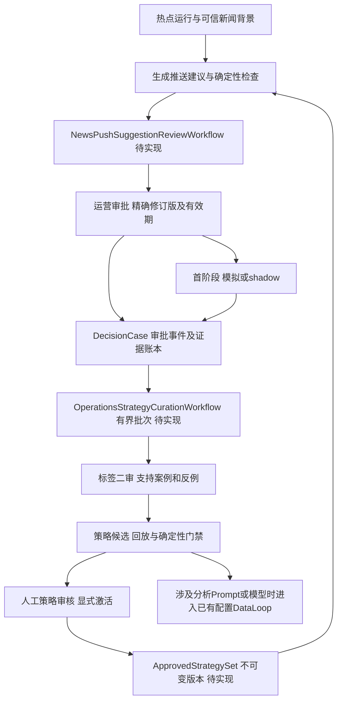

# Temporal DataLoop 链路与长期稳定性

日期：2026-10-04。当前行为以代码核对为准；目标设计明确标为待实现。

## 1. 已有完整调用链

| 层/入口 | 当前核心函数或类 | 转换与下游 |
|---|---|---|
| 热点运营页/两种决策API | `HotNewsDecisionService.record_decision`，`app/services/hot_news_decision.py` | 已完成run/news快照 → 决策；驳回/修正 → 同事务FeedbackCase |
| 自动反馈与聚合发布结果 | `AutomaticHotNewsFeedbackSink`；`PublicationOutcomeFeedbackService.record_and_collect` | 校验失败/低置信/发布聚合结果 → 脱敏可追溯反馈；不含用户行为明细 |
| 标签提交/二审API | `AnalysisFeedbackCollector.submit_label/approve_label/request_label_changes` | 版本化标签、独立复核 → 可冻结或excluded案例 |
| `POST /api/v1/data-loop/runs` | `start_data_loop` → `DataLoopOrchestrator.start` | 可信Principal + 请求 → fingerprint、稳定Workflow ID、Temporal启动 |
| Workflow | `HotNewsDataLoopWorkflow.run` | 冻结Fresh → patch分支固定分析 → 归因 → 评测 → 等待人工 → 记录决定 → 批准后激活 |
| Activity | `DataLoopActivities.run_data_loop_step` → `HotNewsDataLoopStepHandler.execute` | Temporal超时/重试/heartbeat → 纯应用步骤与错误分类 |
| 冻结 | `EvaluationDatasetFreezer.prepare/upload/persist/load_manifest` | 审批截止时快照 → 哈希Manifest/S3 → PostgreSQL Dataset/Case索引 |
| 数据分析（2026-10-07） | `DataLoopDatasetAnalysisService.analyze` → 完整source run → 共享`project_dataset/AnalysisRunner` | 固定overview/quality → S3报告与首次回执 → 评测引用、审批展示；默认关闭，旧历史保持原序列 |
| 回放 | `HotNewsOfflineReplayService.evaluate` → `NativeProductionBundleRuntimeRegistry.create` | 同输入的线上、候选、可选上一实验 → Python Runner/InferencePort → Validator |
| 门禁 | `EvaluationGate.evaluate` | Golden/Fresh/High-risk、绝对指标及双基准 → 确定性pass/fail |
| 晋升审批 | `/runs/{workflow_id}/decision` → `DataLoopOrchestrator.submit_decision` → Workflow `submit_promotion_decision` Update | 租户/阶段/已通过门禁/幂等内容原子校验 → 接受一个决定 |
| 配置状态 | `ProductionBundleApplicationService.approve_candidate/activate_candidate/rollback_bundle` | PostgreSQL候选、审批、激活/回滚账本；批准后原Workflow继续激活 |
| 恢复与线上使用 | `HotNewsDataLoopActivationRecoveryWorkflow`；`ActiveProductionBundleHotNewsService.run` | 只重放原批准的激活；下一热点运行读取本租户Active Bundle并固定快照 |

核心文件位于 `agent/app/api/data_loop.py`、`app/workflows/data_loop.py`、`app/activities/data_loop.py`、`app/services/data_loop/*`、`app/services/production_bundle.py`。Worker装配为 `app/data_loop_worker.py:create_data_loop_worker_runtime/run_data_loop_worker`。

当前回放固定 `analysis_input`，只允许运行时支持的分析Prompt/模型变更。指标、排序、Schema、Validator、Memory等本地资产变化被运行时拒绝，不能把同输入分析回放声称为完整推送策略验收。推送专属标签、场景与评测器须另建版本。

## 2. 已有恢复护栏

| 机制 | 真实当前行为 |
|---|---|
| 启动幂等 | tenant + 业务idempotency_key哈希成Workflow ID；Memo保存全部稳定请求字段fingerprint |
| 审批原子性 | Update validator检查tenant、waiting_approval、gate_passed；同键同内容复用，变化内容/另一个决定拒绝 |
| 超时默认 | 48小时未批准记录system reject，终态approval_expired，不激活 |
| Activity预算 | start-to-close 60分钟，schedule-to-close 90分钟，heartbeat timeout 30秒；每10秒heartbeat |
| 重试 | maximum_attempts=2，即首次+最多一次重试；SQL或显式retryable错误可重试，业务非法输入不重试 |
| 数据层 | 租户复合约束、候选revision/行锁、单租户Active Bundle唯一约束、内容哈希与审计账本 |
| Artifact | 条件写、稳定字节/内容寻址、元数据与读取哈希核验；上传前释放读事务 |
| 评测/激活恢复 | 已提交评测先读账本，不再调用模型；批准、激活、回滚均有业务幂等记录 |

API的批准回执表示Workflow接受了决定；随后记录/激活可能失败，客户端必须继续读取运行/账本状态。当前Orchestrator对终态阶段的再次提交会拒绝，不能将Update内的幂等保证扩大为永久可重放的API收据。

Temporal 的 Update 可验证并返回结果，Signal仅确认服务接收；这也是新审批入口优先复用Update模式的依据。身份鉴权仍由API与业务权限承担。[Temporal Python 消息机制](https://docs.temporal.io/develop/python/message-passing)

## 3. 目标编排：分别运行有界任务

下图为待实现目标。现有配置DataLoop继续保留，避免把所有审批、案例积累、发送和长期学习塞进一个永不结束的Workflow。

- 单条建议Workflow：固定新闻、证据、策略和计划修订；持久等待审批，截止为新闻有效期与批准审核SLA的较早者。不能照搬配置审批48小时作为所有突发新闻的有效期。
- 策略积累Workflow：按tenant/team和摄取批次处理有界案例，记录消费水位、支持/反例、审核材料与策略版本；失败可从已持久步骤继续。
- 现有配置Workflow：仅承担其可执行资产的评测与授权配置晋升。新推送Prompt/策略评测不能假借旧Bundle通过门禁。
- 未来投递Workflow：获得相应生产授权后单独接人群/频控/投递/回执Port；本次没有创建、启动或部署它。

建议另建 `OperationsStrategySet` 和推送运行快照，显式冻结strategy/push-prompt/push-policy/audience/frequency/schema/validator/model版本，并引用既有分析Bundle；不要把新策略版本塞进 `memory_resolver_policy_version`。具体新增Schema与迁移应在实施时独立评审。

## 4. 事实源与双写收敛

| 组件 | 负责的状态 | 不应承担的状态 |
|---|---|---|
| PostgreSQL | 建议、审批、标签、策略、配置、命令/业务收据、消费水位和审计 | 通过页面轮询模拟Workflow控制流 |
| Temporal History | 已调度步骤、Update/Timer、控制流及恢复 | 唯一长期新闻策略证据库 |
| S3/MinIO | 不可变输入/报告/策略导出、URI和SHA-256 | 可修改的唯一Active指针 |
| Redis/SSE | UI事件与可重建缓存 | 审批或策略事实源 |
| 向量索引 | 批准策略/案例的可重建检索投影 | 决定策略是否获批、跨tenant授权 |

当前start/decision直接调用Temporal，没有统一PostgreSQL命令收据/对账器。现有 `models/outbox.py` / `services/outbox.py` 是带writing_jobs外键的写作进度→Redis投影，不是审批命令发件箱。

新链路建议：API同事务保存待处理命令与业务快照 → 专用relay携稳定命令ID调用Temporal → Update验证当前修订/有效期 → Activity幂等落权威决定 → 投影最终收据。命令已保存与决定已生效分别显示；失败不会先在DB标“批准生效”再无期限等Temporal。

relay重试与真正投递副作用分开。Temporal不能给数据库和外部RPC提供联合事务；Activity重放须用业务唯一键和回执查询收敛。发送超时进入 `unknown/reconciliation_required`，先查询原任务，不改键重新提交。[Temporal 幂等与副作用说明](https://temporal.io/blog/idempotency-and-durable-execution)

## 5. 跨天、迟到反馈与水位

当前 `_freeze_dataset` 把 `source_cutoff_at` 固定为业务 `window_end`，Repository同时要求案例发生在窗口内、记录和标签批准不晚于cutoff。它提供正确的点时快照，但如果只按不重叠的“当天发生窗”每日取样，次日才审批的当天案例就会漏掉。

例如10月4日的案例在10月5日完成标签二审：4日窗不接受5日标签，5日窗又排除4日发生时间。不能通过修改已冻结的4日数据集补入。

目标设计保留 `occurred_at/recorded_at/review_completed_at/ingested_at`，按摄取提交序列或审批完成水位消费，并为跨窗待处理案例建账本。批次固定独立cutoff；迟到标签进入下一批/新的回补版本。

消费水位必须处理提交乱序：可用经过验证的提交顺序来源；否则使用有界重叠扫描 + `(case_id,label_version)`唯一消费键 + reconciliation。不能简单以自增ID最大值代表所有较小ID均已提交。

先提交批次成员/结果，再原子推进水位；崩溃重跑同成员，修改标签产生新版本并supersede，保留旧集血缘。批次超过限额应确定性分片、排队，避免永久丢弃或把超量误报成无反馈。

## 6. 部署演进与失败分级

Workflow内只做确定性控制流；模型、SQL、RPC、对象存储和真实时间读取放Activity。输入快照固定所有影响行为的版本，不从可变“最新Prompt”中重放旧运行。

目前没有Worker Deployment Versioning、`patched/deprecate_patch`或历史Replay兼容套件。Workflow名称含v1并不能自动保证变更兼容；发布前应采用匹配当前SDK/Server的patch或版本部署方案，重放含待审批/已激活/过期等历史。[Temporal Python 版本演进](https://docs.temporal.io/develop/python/versioning)

当前Compose Server固定1.27.2，Python依赖范围为 `temporalio>=1.8,<2`。先记录实际SDK版本并验证兼容性；本方案不依赖新版本Update-With-Start，也不自动升级服务或依赖。

有界Workflow优先自然结束。确需长期协调器时才使用Continue-As-New，携带必要状态并在主流程等待消息处理器完成，业务去重键不依赖会变化的Run ID。[Temporal Continue-As-New](https://docs.temporal.io/develop/python/continue-as-new)

持久日常调度使用Temporal Schedule；需定义重叠、catch-up、回补与激活冲突策略。案例采集Schedule不应被一个等审批的候选运行阻塞，积累批次与发布等待应分开。[Temporal Schedules](https://docs.temporal.io/develop/python/schedules)

| 故障 | 处理原则 |
|---|---|
| 身份/权限、正文撤回、证据不足、哈希错误、标签未审 | 阻断相关下游，不发送/不晋升 |
| DB/S3/模型暂态失败 | 有界重试；已提交步骤读账本；逐case检查点避免重做整个批次 |
| 归因/解释不可用 | 可降级，不改变确定性门禁；材料明确缺失 |
| 审批过期或改稿 | 结束/重新审；迟到批准不复活过期建议 |
| 模型结果结构非法 | Validator失败，进入反馈；不静默放宽Schema |
| 副作用结果未知 | 保留原幂等键、查回执/对账，人工处置；不宣称失败或成功 |

这些是目标护栏。现有回放提交前还没有逐case持久检查点/全局单飞；其Semaphore只限制单次replay，并非跨Worker/租户配额。离线factory当前默认模型租户 `offline-evaluation`，DB/S3隔离不等于模型配额/审计已经透传真实tenant。

## 7. 配置与运行依赖

| 配置入口 | 当前用途 |
|---|---|
| `TEMPORAL_ADDRESS` / `TEMPORAL_NAMESPACE` / `TEMPORAL_DATA_LOOP_TASK_QUEUE` | Temporal连接、命名空间、专属任务队列；默认队列hot-news-data-loop |
| `MODEL_RUNTIME_CONFIG_PATH` | 原生模型/Prompt YAML；企业InferencePort或隔离同Port替身 |
| `HOT_NEWS_RUNTIME_MANIFEST_JSON` | 允许执行的不可变分析Bundle清单；为空失败关闭 |
| `DATA_LOOP_REPLAY_MAX_CONCURRENCY` | 单次回放并发，默认8；不是全局配额 |
| `DATA_LOOP_MAX_CASES_PER_COHORT` | 每层案例上限，默认20；超量需分片 |
| `DATA_LOOP_GATEWAY_TOKEN` | 可信网关共享凭据；这里只记录名称，不读取值 |
| `DATABASE_URL` / `REDIS_URL` | 事实库/事件投影依赖 |
| `ARTIFACT_BUCKET/ENDPOINT/REGION/PREFIX`及加密配置 | S3/MinIO不可变Artifact |

审批48小时和Activity预算目前为代码常量，不是可直接填写的运营策略配置。尚无推送生产Port配置或策略注册表配置。`standalone` Compose的DataLoop Worker属于 `data-loop` profile；当前 `native-e2e` Compose没有该Worker，不能仅看到API健康就认为DataLoop任务会执行。

外部依赖为Temporal、PostgreSQL、Redis、S3/MinIO与企业原始模型接口；不引入外部Agent/知识框架。网关必须剥离客户端身份/角色头并阻止绕过，企业权限部署仍需验收。

## 8. 长稳观测

新增观测应覆盖：各队列等待时间/最老年龄、审批剩余有效期和过期率、迟到案例和补偿积压、水位停滞、命令pending/unknown、评测重复调用、Artifact完整性、策略来源/反例覆盖、撤销和回滚、租户配额与各阶段时延。日志以tenant/run/case/suggestion/decision/strategy/bundle为关联键，避免用户明细和敏感值。

当前 `/metrics` 主要覆盖写作/outbox，并未完成上述DataLoop观测。指标阈值、告警接收人、保留期、恢复RPO/RTO与容量应作为待批准运维政策，不在此文虚构生产目标。
