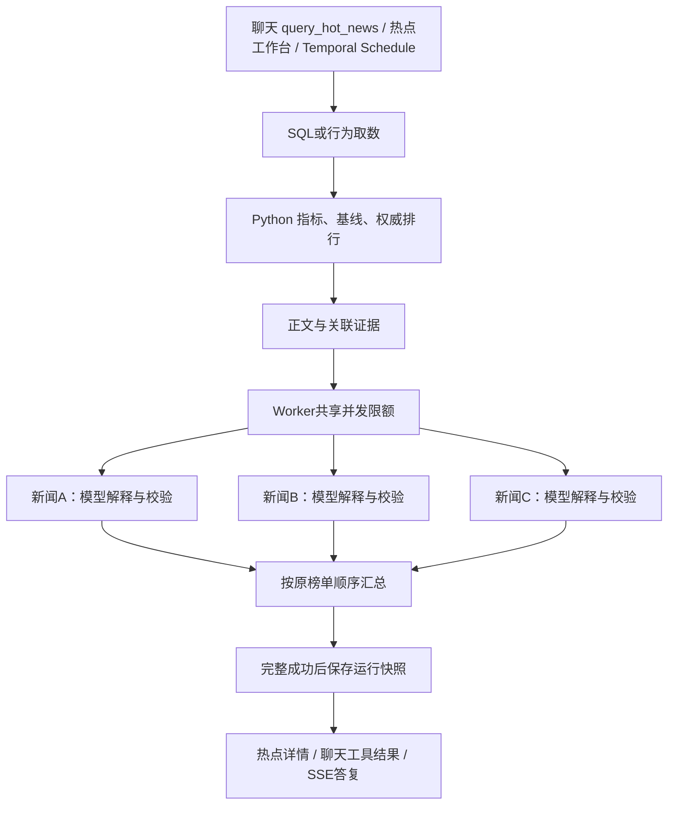

# 热点新闻批量分析并发

本次把同一热点运行中互相独立的新闻分析改为有界并发。查询、聚合、热度排序和证据准备
仍按依赖顺序执行；每篇分析沿用已有输入快照、模型 Port、校验器和校验反馈重试。



## 并发保证

- `HotNewsAnalysisBatch` 使用固定数量协程处理一批新闻，最多创建
  `min(新闻数, 并发上限)` 个任务，不为每篇无限创建协程。
- `ActiveProductionBundleHotNewsService` 在 Worker 生命周期内只创建一个分析执行器。
  不同租户、窗口和 run-scoped 服务共享其 Semaphore，避免每个运行分别占满同样的配额。
- 输入位置绑定结果槽位；先完成的新闻不会抢占榜单第一名。汇总后再沿用既有持久化链路，
  `news_id/rank/analysis_input/model_request_id` 始终属于同一篇新闻。
- 任一任务失败后停止领取新任务，取消其余协程并等待清理，再原样抛出错误。不会用
  `ExceptionGroup` 隐藏原来的 `retryable/request_id` 或破坏 Activity 的错误归因。
- 新执行器不增加重试。单篇分析的校验反馈重试、模型 HTTP 超时和 Temporal Activity
  的有界重试继续由原有层负责；一次单篇分析从初次调用到校验重试都占用一个名额。
- 并发上限设为 1 时走串行路径。空批次不调用模型。部分成功不会被保存成整轮成功。

## 完整调用链和配置

1. `/chat` 的 `ConversationAgentService → ConversationTools.execute_hot_news_query →
   LocalConversationHotNewsQuery → execute_local_hot_news_query`，或热点工作台/调度入口，
   创建原有 `HotNewsMonitorWorkflow`。
2. Workflow 调用 `HotNewsActivities.run_hot_news_window`；`create_hot_news_worker_runtime`
   将 Settings 中的并发配置注入 `ActiveProductionBundleHotNewsService`。
3. 每次运行解析不可变 Production Bundle，并创建 run-scoped
   `HotNewsOrchestrationService`；SQL 查询和指标/排行由 Python 完成，证据转换为
   `EnrichedHotNews`，经过既有身份与顺序校验。
4. `HotNewsAnalysisBatch.analyze` 并发调用 `HotNewsAnalysisService.analyze_with_snapshot`。
   后者生成独立 `HotNewsAnalysisInput` 快照，经 `NativeHotNewsAnalysisRunner →
   StructuredInferenceService → InferencePort` 调用兼容模型接口，再通过确定性 Validator。
5. 分析结果按输入顺序组装 `AnalyzedHotNews`，性能记录写入
   `HotNewsRunResult.analysis_execution`。`PostgresHotNewsRunStore` 的已有递归序列化器
   把两者一起保存到 `analysis_runs.result_payload`，无数据库迁移。
6. `HotNewsQueryService.get_run_detail` 将执行记录投影为可选
   `HotNewsAnalysisExecutionView`；热点页面展示任务数、峰值、上限和毫秒耗时，聊天工具
   通过 `render_tool_results` 展示 Python 记录的数值。旧快照没有该字段时返回 null。

配置：`HOT_NEWS_ANALYSIS_MAX_CONCURRENCY`，范围 1–16，Settings 默认 1；独立本地
`docker-compose.native-e2e.yml` 显式设为 3。改变配置需要重启热点 Worker。
这是运行资源配置，未修改 Prompt、模型、业务 Schema、热度规则或 Production Bundle。
既有已完成运行仍幂等复用，不会因为改变并发上限而自动重新分析或补写历史性能记录。

外部依赖保持为已有 PostgreSQL、Redis、Temporal、模型 HTTP Port 和知识检索 Port；
没有新增 Agent 框架、数据库表或自动发布权限。不同新闻的 SQL 取数没有在此修改为并发。

`analysis_execution` 包含 `executor_version=bounded-analysis-v1`、`max_concurrency`、
`observed_concurrency`、`task_count`、`elapsed_ms`。耗时覆盖完整分析批次，包括等待其它
运行释放名额，但不含前面的 SQL、基线和证据检索。峰值是本批次实际同时分析的任务数。
批次终态日志仅记录状态、任务数、上限、峰值和耗时，不记录正文、原始行为或模型输出。

## 可复现演示与验证

在 `agent/` 目录使用项目测试环境执行：

```sh
python -m examples.hot_news_concurrency_demo --concurrency 3 --delay-ms 200
python -m pytest tests/test_hot_news_analysis_batch.py tests/test_hot_news_orchestration.py tests/test_active_bundle_hot_news.py tests/test_native_hot_news_runtime.py tests/test_hot_news_api.py
```

演示经过完整本地域链路和校验，用同 Port 的确定性本地模型，并人为加入网络等待。
无需数据库、网络、密钥或真实模型调用。2026-10-05 的一次实测：五篇新闻，串行分析
1043 ms，三路并发 420 ms，分析阶段约 2.48 倍；榜单、权威指标和分析报告均一致。
这不是企业模型质量、真实端点吞吐或端到端响应时间承诺。

并发单测通过 Event 屏障检查实际重叠、上限、乱序完成后的顺序、跨运行共享名额、错误
类型保留、等待取消清理、失败后名额回收和串行兼容；不依赖易抖动的毫秒阈值。
原生链路测试分别使用 1 和 3 的配置验证新闻/报告绑定。API 和持久化测试覆盖性能记录投影。

本次相关后端回归 124 项、修复镜像组合回归 93 项、前端 155 项通过；前端类型检查、
构建、相关 ESLint 和 `git diff --check` 通过。未声称跑过全部后端测试。

## 当前边界与 TODO

- 当前额度是每个热点 Worker 进程共享；多副本、其它聊天/SQL模型调用不共享此额度。
  生产仍需要按端点/租户治理 RPM、TPM 和跨副本额度。
- 取消协程会终止本地等待和请求；模型供应商已经接受的推理是否停止，取决于接口合同。
- 并发任务仍属于一个有界 Temporal Activity，未拆成逐篇持久化 Activity/Checkpoint。
  若整轮失败，Activity 重试可能重新分析此前已成功的新闻；HTTP幂等Header的供应商语义
  仍需合同验收。整轮失败的成功子结果没有当成成功报告持久化。
- 当前真实模型的限流、并发质量和长稳测试尚未完成；之前证据ID不合法的模型输出仍会被
  拦截。并发优化不会修复“没有匹配新闻”或“报告未完成”的业务问题。
- 本地部署使用只包含本次补丁的 `hot-news-concurrency-20261005` 镜像；后续完整部署应从
  当前源代码重建镜像。原 API/热点 Worker 容器保留为停止状态，便于回滚。
