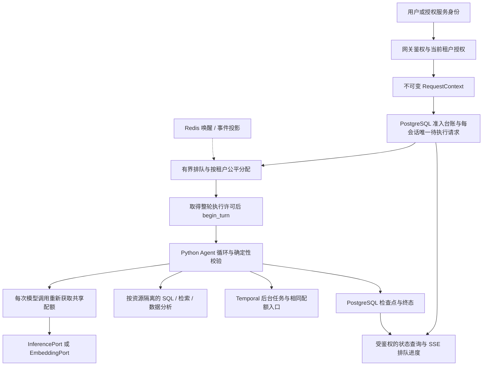

# 多租户并发设计与测试契约（设计稿 v2）

日期：2026-10-09。状态：待实现、待验收。本文重新审视
[`conversation-concurrency.md`](conversation-concurrency.md) 的设计部分；原始压测结果保留。
本次不改变应用执行策略、生产模型/Prompt、数据表或部署，不执行新的模型压测。
配置名、组件名、新接口及新增测试名均为拟议契约，不能当作当前已有能力。

## 1. 先明确租户与测试目标

租户是组织、部门或业务团队的数据与资源边界，用户是该租户中的成员。一个用户可属于
多个租户，但每个请求只能绑定一个经过身份系统授权的租户。每位客户到底对应组织还是
个人，应由接入的身份合同决定，不能用随机 user_id 自动推导生产 tenant_id。

上次测试是 **1 个租户 × 100 个独立用户**，只额外验证更换身份读取已有会话被拒绝；
它没有验证 10 个租户 × 10 个用户或 100 个租户 × 1 个用户的竞争、公平性、业务数据
隔离和真实入口鉴权。100 个 SSE 都建立、66 个轮次 completed，并非多租户容量验收。

本设计分别要证明：

- 身份与数据隔离：任何请求、重放、工具、后台任务和进度读取都不会进入其他租户或
  其他用户的私人作用域。
- 性能隔离：一个租户创建很多用户、会话或后台任务，仍不能无限占用共享模型、工具、
  数据库和队列，普通租户能按其配额取得服务。
- 执行一致性：重复提交、跨副本重连、取消、进程崩溃或租约回收不会启动第二次业务
  执行，也不会让旧执行者覆盖新的终态。

## 2. 当前实现与缺口

| 当前代码 | 已有能力 | 多租户缺口 |
| --- | --- | --- |
| `app/api/dependencies.py:get_hot_news_principal` | 共享网关凭据、tenant/user、角色检查 | 依赖网关剥离和注入身份头；共享凭据不是用户身份验证，也不验证组织成员关系 |
| `app/api/jobs.py`、`app/api/events.py` | JobService 读取按 tenant 过滤 | 仍依赖裸 `get_tenant_id/get_user_id` Header，main 无全局鉴权；需统一身份与写作权限合同 |
| `app/api/knowledge.py` | 知识写入需要采集token与tenant | 共享采集token未限定allowed tenants；需要授权服务身份，不能发给所有客户 |
| `app/models/conversation.py`、`repositories/conversation.py` | 所有权复合外键、UUID幂等、行锁、同会话 processing 唯一索引 | 无排队/准入事实记录；processing 的过期依据 created_at，不能直接塞入长队列 |
| `app/model_runtime/agent_client.py` | ContextVar 的 tenant/trace 请求绑定和 reset | 没有全局资源配额；后台任务不能只靠继承 ContextVar 传身份 |
| `app/conversation/service.py`、`streaming.py` | 单轮预算、有界工具、检查点、取消清理、校验后答复 | 无租户公平排队；模型失败折叠为 model_unavailable；断线默认取消当前聊天执行 |
| `app/services/hot_news_query.py` | 热点报告按 tenant 和 completed 过滤 | 租户级共享报告与用户私人聊天权限需分别明确，不能沿用一种 ACL |
| `app/db/session.py` | 每实例 20+20 连接、独立异步事务 | 多进程总连接预算未配置；不能默认所有路由都释放了长期 SSE 的数据库会话 |
| `app/data_analysis/runner.py` | 实例内 Semaphore、子进程资源限制 | 等待槽不在执行计时内；没有跨副本、按租户的排队公平与等待上限 |
| `app/hot_news_worker.py` | Temporal Workflows 与队列 | 无显式 Activity 全局租户预算；run 内并发不是跨 run 或跨 Worker 配额 |
| `tools/conversation_load.py` | HTTP/SSE、单租户合成用户、终态/重放/越权检查 | 无多租户数据夹具、按租户指标、噪声租户、固定到达率、跨副本和故障测试 |

上述为工作区代码审查；部署镜像可能不同。开放写作/发布/进度等路由前要逐一核对真实
网关、网络入口和鉴权，不能把聊天权限测试扩展成全项目鉴权已经完成的结论。

## 3. 总体选择：共享运行时，分层配额，PostgreSQL 保存事实

先采用共享 Python API/Worker 与共享 PostgreSQL，按 tenant 分离数据、策略和配额。
100 用户阶段不为每个租户起一套 Agent 进程或数据库连接池；Python 服务实例保持无
请求级可变状态，历史、工具结果和上下文缓冲各自属于请求。达到明确的容量或权限合同
要求时，再给特定租户独立 Worker/数据库/模型账号，沿用同一 Port 和业务 Schema。

PostgreSQL 保存准入请求、队列、执行绑定、策略版本、配额租约及审计。Redis 仅用于
通知、缓存和进度投影；通知丢失由有限轮询数据库补偿，不把 Redis 当作业务事实源。
这延续项目“PostgreSQL 是事实源、Redis 做缓存/事件”的边界。100 用户阶段优先验证
数据库协调器的正确性与开销，再根据数据决定是否需要独立调度服务。



## 4. 身份和数据隔离

### 4.1 身份由服务端建立

拟议 `RequestContext` 包含 tenant_id、user_id 或明确的 service_actor、permissions、
workload_class、trace_id、admission_id、deadline 和 policy_version。用户选择租户只是
申请，网关必须验证成员关系后才签发上下文；清除外部传入的角色/身份头，再通过已认证
的服务链传递。直连后端必须受网络限制或验证签名身份，不能只凭共享 token 加自填
tenant Header。现有本地演示 Header 仅可用于隔离测试。

用户内容、LLM 计划、SQL、检索片段都不能提供或改变这些字段。API、工具层与后台入口
都从可信上下文取身份。权限与租户停用状态在真正派发前再次核对，不能执行已经被撤销
的排队请求。采集/QA服务凭据也必须绑定获准租户和能力，不能仅凭共享ingest token写
任意tenant。持久 Workflow 保存服务端绑定的身份引用，并在新 Activity 开始时校验策略；
不得假设 ContextVar 会跨进程、跨天或穿过 Temporal 自动正确传播。

### 4.2 明确每类资源的可见性

| 资源 | 默认作用域 | 必测边界 |
| --- | --- | --- |
| 会话、摘要、工具轨迹、私人 Memory | tenant + user + conversation | 同租户不同用户、同 user_id 不同租户、软删除、恢复、重放 |
| 热点报告、聚合指标、新闻库 | tenant + 明确授予的业务读权限 | 同 news_id/run_id 请求不能跳过所属租户检查；不默认私有文档可共享 |
| 写作任务、Artifact、审批/发布 | tenant + 显式团队/任务 ACL 与操作角色 | created_by 不自动意味着只有作者可读，租户管理员也不自动有发布权限 |
| Data Loop、Bundle、评测 Artifact | tenant + 管理权限与人工审批角色 | 跨租户晋升、激活、回滚、下载均拒绝 |
| 队列项、配额详情、SSE/状态查询 | tenant + owner 或已授权运维角色 | UUID 难猜不能代替权限；不能暴露其他租户排队位置或请求信息 |

Repository 保留 tenant 条件，子表通过复合外键或已授权父实体约束。对象存储先鉴权
数据库 Artifact 记录，再校验 URI 的期望 tenant/job 前缀；前缀和 SHA-256 本身不是
访问权限。Redis key 带 tenant，读取前仍检查所属资源和角色；不只靠 key 拼接隔离。
向量召回必须先按 tenant/语料 ACL 过滤再做 top-k，之后校验返回记录作用域。缓存 key
包含 tenant、可见性/ACL版本、数据与模型版本；私人结果另含 user/conversation。公共
新闻可另设经过批准的 corpus 命名空间，不能遇到未命中就回退到全库。

建议在敏感表逐步增加 PostgreSQL RLS 作为第二层防护：事务内 `SET LOCAL` 租户上下文，
连接复用后不能残留；API/Worker 使用非 owner、非 BYPASSRLS 角色，迁移角色分开。
跨租户scheduler使用独立最小权限协调角色，只操作调度元数据与受控函数，不授予它
读取所有租户正文/私人会话的权限；实际执行加载载荷仍绑定已授权admission的租户。
插入/更新同时检查新行作用域，子表与导出链同步覆盖。现阶段代码未实现这套 RLS，
不能只建一条 policy 就宣称隔离完成。[PostgreSQL 官方说明](https://www.postgresql.org/docs/current/ddl-rowsecurity.html)

## 5. 资源配额与公平调度

### 5.1 控制不同资源，不把它们合并成一个 semaphore

| 层级 | 控制对象 | 释放时机 |
| --- | --- | --- |
| 连接 | 全局/租户 SSE 数、重连频率、读状态速率 | 连接结束；重连只增加观察连接，不增加执行 |
| 准入 | 全局/租户/用户待执行数、队列字节与等待时限 | 派发、取消或排队过期 |
| 整轮 | 全局/业务类别/租户/用户 active_turns | 轮次持久终态；不因每次模型结束而释放 |
| 会话 | queued 或 running 请求最多一个 | 排队/执行终态；防止在多个副本分别排同一会话 |
| 模型 | provider quota_scope + route；在途调用、RPM、TPM | 单次调用完成或经过确认的清理；速率消耗不会随 permit 释放撤销 |
| 工具 | SQL、向量检索、Embedding、数据分析各自配额 | 本次实际资源操作结束；排队算入调用预算 |
| 后台 | 各类别任务在途/队列数与资源预算 | 各 Activity/Job 的真实执行边界，不能只数聊天连接 |

`quota_scope` 由服务端绑定供应商账号/共享额度组。同一账号下多个 model route 可能
共用上限，不能简单按 route 独立限流。不同企业账号可分别预算，但不能允许模型从
消息中选择其他账号。用户创建更多会话不能突破 user/tenant 配额。

聊天、热点、写作、入库和上下文压缩最终共享同一配额入口。**一个 Agent 整轮不能
一直持有模型槽**：模型调用拿槽，用完归还；SQL、等 Workflow 和人工审批时不占模型
执行额度。整轮执行许可与模型 permit 分开，任何等待不持有数据库连接/事务。
资源获取按固定顺序短事务原子检查，失败不先占全球槽再等租户槽，避免资源空转与死锁。

RPM 按实际调用尝试扣账，重试同样消耗；TPM 派发前预留输入估算和输出上限，响应后
按供应商合同核对 usage。缺失 usage、异常响应和取消按保守成本结算，不能全额退款。
项目现有字符预算不能视为精确 token 数，InferenceRequest 也未显式约束输出tokens。
严格TPM必须先验收route绑定的tokenizer/保守上界、供应商执行的硬输出上限和usage
合同；这些条件不满足时只能称为估算预算，不能承诺精确供应商TPM限额。

### 5.2 采用按租户的加权轮转，加上硬上限

每个资源池先在交互和后台业务类别之间按已配置份额调度，再对有可运行请求的租户做
加权 deficit round-robin；租户内按用户轮转、每用户 FIFO。同权重同成本的持续负载
接近等份，长上下文按估算 token 成本扣 credit，不能让巨大的单次请求与短请求一直
按相同成本竞争。credit 有上限，空闲租户不积累无限“欠账”。有等待请求但暂时触及
TPM/硬上限的租户不是当前 eligible，不得阻塞其他租户。

硬上限控制风险，权重控制争用时的份额；没有竞争时允许借用闲置份额，仍不突破硬上限。
借出的执行不可抢占，新租户到来后停止给借用者追加派发，并在旧调用结束后重新分配。
公平等待边界包含已运行请求的最长受控执行时限，不能承诺立即取回资源。

例如实验中 provider 全局 10 个调用槽、10 个租户等权，不给每租户静态承诺同时一个
槽；有 100 个活跃租户时也不可能静态保证每个租户一个槽。租户硬上限 2 是最多可以
占多少，不是每个租户预占 2。少量后台保留份额的总和必须 ≤ 全局窗口，并允许有界
借用。硬上限2也会让仅一个活跃租户时剩余8槽空闲，这是风险限制的明确代价；如要
允许它借用到10，必须把该租户获准的hard cap配置到10，公平权重仍负责争用时分配。
数字只是本地实验起点，真实上限应由模型错误分类和供应商配额确定。

共享 FIFO 加租户 cap 仍可能让先到的噪声租户拖慢后来的小租户；单机 semaphore 也
不能证明跨副本公平。scheduler 的选择、成本扣账与租约授予需在 PostgreSQL 同一
短事务提交，多 scheduler 副本不能各算出一套全局空槽。所有同时操作计数和会话的
路径遵守同一锁序：资源池/配额scope（多scope按key排序）→ workload/tenant/user
计数行（按key排序）→ conversation → admission/turn/lease（按key排序）。准入、
派发、取消、回收、删除和恢复都遵守；不需要quota的纯会话操作可从conversation开始，
但不能之后倒过来取quota锁。资源等待必须退出事务再重试。执行逻辑由Python实现。
需要多资源共同约束的调用原子校验全部计数，但只占它将实际使用的资源。全表FIFO
的SKIP LOCKED仅减少消费者冲突，不提供租户公平，不能代替持久轮转状态。

## 6. 排队、幂等和执行状态

### 6.1 新增独立准入台账，不修改已有 turn.status 的含义

拟议 `admission_requests` 保存：所有权、conversation_id/request_id、内容指纹、
有界加密/受控请求载荷、政策版本、创建/截止时间、workload、state、turn_id、执行者
和 generation，以及连接执行owner的租约/取消标记。
排队状态是 `queued`，不是现有 `ConversationTurnRecord.processing`。
实际执行仍使用原 turn 表、Schema、检查点和业务终态。

唯一键为 `(tenant_id, user_id, conversation_id, request_id)`；conversation 全局 UUID
保持原有唯一性。每会话 queued/running 最多一个请求。所有会话写入口共同使用父
conversation 行锁，使准入表、现有 processing 唯一索引与软删除互相一致。旧 v1
入口如果绕过准入，新保证就会失效：实现时必须统一接入或明确关闭绕过路径。

推荐操作顺序：

1. 鉴权、Schema/大小检查、确认所属会话、规范化内容。读到已有终态且指纹相同，
   直接重放，受廉价读限流而不占模型/执行配额；同 UUID 改内容返回 409。
2. 按统一锁序取得需要的计数锁再锁会话，再次检查重放与活跃项。相同请求已
   queued/running就返回其状态，不再入队、不再扣账；计数、会话占位和幂等绑定
   同事务。附着者无执行取消权；同会话不同请求409。同一request_id在别的会话/
   租户可独立使用，但不能查询或重放原请求。
3. 未受理的新请求若队列/用户/租户上限已满，返回 429；依赖不可用返回 503；携带
   有界 Retry-After。这些未受理请求可用同 UUID 重试，没有先偷偷启动 Agent。
4. 允许受理则持久化 queued 项和请求指纹，提交后才能告诉客户端已受理。排队超时
   或取消成为准入终态，不调用模型、不创建 processing turn；已受理请求若要重新
   执行必须显式使用新 UUID，不能终态重放时偷偷再执行。
5. scheduler 按公平策略取得整轮许可；同一短事务再次校验所有权、权限和活跃项，
   `begin_turn` 的原子插入与 admission.turn_id/generation 绑定共同提交。需要
   repository 扩展共享事务，不能先创建 turn 再单独保存准入绑定留下崩溃间隙。
6. 执行者运行原 Agent；每次模型/工具操作独立取资源配额，按第7节完成或保留unknown
   许可。轮次检查点/
   终态与准入状态/整轮许可释放同事务提交；失败仍保留真实错误和已有证据。

### 6.2 SSE/API 需要版本化排队契约

当前 SSE 的 accepted 已有 turn_id，并默认 processing，不能把 queued 请求塞进去
假装它已经运行。新契约拟提供 admission_id、request_id、state、queue_wait_ms、
turn_id（未运行时为空），以及 queued/started/done/error 事件；不承诺准确全局队列
位置。JSON入口先保持同步、有界等待终态，另加显式断线检测；SSE入口持续观察
排队与执行。状态链接供附着观察者查询，不引入JSON 202后继续后台执行的语义。
状态链接与重连仍按 tenant+user 鉴权。重连/终态重放只观察原执行，不建立第二个任务。

默认保持现有取消意图：执行owner关闭未完成的JSON/SSE连接，取消queued请求；执行中
进入有界取消清理，保留interrupted终态和检查点。附着观察连接关闭不取消原owner；
硬崩溃/未收到断线靠owner租约与超时恢复，不自动补跑聊天。取消与dispatch、finish
与interrupt、heartbeat与回收用数据库CAS/generation竞争，终态不可回写。换副本
重连可能读到interrupted终态，只允许显示它或显式新UUID发起新轮，不承诺原执行恢复。
后台已启动的 Temporal Workflow 继续按原持久任务语义运行，聊天断线不自动取消它。
若将来要“聊天断线仍继续执行”，应作为另一个明确的用户行为契约实现。

排队超时、整轮执行超时、模型等待/调用超时和连接预算分别度量：

```text
end_to_end_deadline >= admission_queue_wait + active_turn_budget + cleanup_margin
active_turn_budget 包含每次模型/工具排队、调用、重试、历史压缩和保存
```

等待期间不能占有 PostgreSQL 事务。现有 turn 的 created_at 过期只覆盖真正开始执行
后的预算；新的队列截止时间不会修改它。现有GET/delete/begin_turn按created_at
恢复的路径须统一核对owner租约和generation，不能中断仍合法执行的请求，也不能
允许无限续租突破绝对执行截止时间。删除/恢复会话也要检查准入queued/running。

## 7. 租约、失效与外部调用的边界

拟议 `resource_leases` 保存 resource_scope、tenant/actor、owner_instance、generation、
state、取得/续租/最大执行截止时间、保守 token 预留和 call_id。新派发原子创建 permit，
释放/续租必须匹配 lease_id+owner+generation；重复释放是无害操作，旧执行者不能删掉
新许可。只有有效 generation 可以提交新的业务检查点；已有终态保持不可覆盖。

每次取得模型/工具许可和启动有副作用Workflow前，都原子核对admission的owner、
generation、取消标记与绝对截止时间；不能只在保存结果时检查。已失效旧owner恢复
后不能开启新步骤。已经标记派发的操作按未知外部调用/原Workflow幂等语义处理。

先持久提交`dispatching`标记，再发送外部HTTP请求；一旦进入dispatching就按“可能
已发出”保守处理。不能在收到响应/供应商request id之后才标记，否则HTTP写出后
进程崩溃会被错误当作尚未派发。一个模型lease仅对应一次实际attempt；同一admission
的重试取得独立lease并另扣实际调用预算，回收不把未知调用变成免费的新派发。

已知“尚未派发外部调用”的过期许可可回收。**模型调用已经发出时，客户端断线或租约
过期并不能证明供应商已经停止执行。**这类许可进入 draining/unknown 保守占用，在
可确认取消/完成或经合同确定的服务端最大调用期限后回收。没有服务端可证明的最大
期限时需报警/人工处理，不能靠很短 TTL 自动重用槽以宣称严格控制了物理并发。
应用的 generation 保护持久结果，不能隔空阻止外部模型继续耗费 token。

PostgreSQL 协调器不可用：停止新准入/派发，返回 503；执行者不启动新的资源步骤，
保守等待/中断，不能回退到每副本独立 semaphore。Redis 不可用：允许有限数据库
轮询，继续依据持久记录调度，SSE 进度可降级；租户身份和配额不绕过。恢复后重建
投影，不重新启动已终态业务。Redis 的异步复制/故障切换本身也不保证锁互斥，因而
本阶段不选它作为权威业务许可账本。[Redis 官方说明](https://redis.io/docs/latest/develop/clients/patterns/distributed-locks/)

供应商 429 按其真正 scope 施加 cooldown，遵守 Retry-After；若是租户专用账号失败，
不熔断其他账号。5xx/连接异常采用有界退避与抖动；明确尚未派发或供应商确认结束的
尝试可释放许可后等待，已派发后未知结果保留原unknown reservation。重试重新进
公平队列、拿独立许可，不退款原未知调用，也不能把gateway 5xx当作远端已停止。
RPM/TPM消耗保留。模型侧 Idempotency-Key 是否真正保证一次调用需要
合同确认，应用不能承诺网络不确定状态下供应商 exactly-once。

## 8. 后台、数据库和可观测性

Temporal 先继续按聊天交互以外的热点/写作/入库业务类别分队列，租户公平由共同的
Python 资源调度入口保证，不为 100 个租户各建一套 Worker。Activity 以有界任务和
明确限速执行；不要启动大批 Activity 只为让它们阻塞等待同一模型槽。平台原生公平
能力可以后续评估，但必须核对当前 self-hosted Temporal 与 Python SDK 的版本和
配置，本文不把最新文档能力当作已部署功能。[Temporal 多租户模式入口](https://docs.temporal.io/best-practices)

数据库所有 API/Worker 的连接池求和，加运维余量后必须小于数据库可用连接。SSE
鉴权/父资源读取使用短会话；不能沿用 request-scope Session 持续整个长流。SQL 查询
还须 statement/lock/pool timeout 与每租户/每资源在途限制。Agent 串行保持当前
步骤依赖；只对独立且有界任务并行，不为增加吞吐跳过数字校验和人工 Gate。

监测按租户和 workload 分别记录 admitted/rejected/expired/cancelled/completed、
queue_wait、model_queue_wait、model_latency、SSE首个进度/首个有效答复、业务错误、
tool denial、租约回收/unknown、RPM/TPM、模型HTTP错误分类、工具等待、DB pool/
query/lock等待和 Temporal backlog。请求/会话/模型 request id 放审计或 trace，
不作为无限增长的指标 label；tenant label 也需在生产控制基数。

必须同时报告尝试数、受理数、拒绝/过期数、业务完成数和满足工具目标的数，不能把
排队过期或限流拒绝剔除后宣称整体成功率 100%。同样不能只报成功样本的 P95，失败
和拒绝延迟要单列，SSE首进度不能当作答复耗时。

## 9. 后续测试矩阵与可判定的通过条件

### 9.1 先确定性测试调度，再测真实模型

第一轮使用实现相同 InferencePort 的隔离替身，控制每次 2 秒/10 秒、输出成本、429、
取消确认与连接失败，配合真实 PostgreSQL、至少 2 个 API/执行者/调度副本。替身用于
证明配额和故障语义，不做企业模型质量验收。测试时独立采集服务端 lease/dispatch
时间线，不用客户端在途峰值替代真实调度指标。

第一阶段主要聊天、知识、已有报告；本地新建热点目前只允许特定 E2E 租户和管理员，
其他合成租户不得随意开启。多租户新热点/写作混合负载须先补授权、合成窗口/语料
配置与租户夹具，并保留原 Workflow 与人工审批链。

| 场景 | 负载/动作 | 必须验证 |
| --- | --- | --- |
| 单租户基线 | 1×100 用户 | 保留旧测试对照；全局/租户窗口不超限，真实错误分类可追溯 |
| 均衡多租户 | 10×10，另测100×1 | 每租户都取得服务；相同成本/权重下的分配符合轮转，无永久饥饿 |
| 噪声租户 | 1租户80用户，4租户各5用户，总100 | 噪声租户不突破硬上限；少量租户的等待尾部不被80用户持续挤占 |
| 权重/借用 | 1:2 权重持续 backlog；空闲租户恢复 | 池持续饱和且租户硬上限不成为瓶颈时，派发cost份额约1:2；借用在调用结束重新分配 |
| 会话竞争 | 同会话同/不同 UUID，经不同副本提交 | 同UUID只排队/运行一次；不同UUID 409；同UUID改内容409 |
| 数据串扰 | 各租户专属合成证据；复用user/news/request业务标识 | 历史、摘要、知识、报告、缓存、导出、事件、审批均只返回已授权证据 |
| 身份伪造 | 外部篡改tenant/user/role Header、提示词指令 | 真实网关拒绝未授权租户/角色；后端直连无凭据失败；模型工具不能注入身份 |
| 长短请求混合 | 长上下文/压缩与短问题同池 | 成本扣账、输出上限生效；短请求不永久饥饿；压缩也消耗共享模型预算 |
| 全局速率 | 共用账号的多route与聊天/后台混合 | 部署总在途/RPM/TPM满足合同；不是每个route/进程分别算上限 |
| 队列满/过期 | 超过用户/租户/全局队列和字节上限 | 未受理429可安全同UUID重试；queued过期不调用模型；状态可查询且理由明确 |
| 取消/重连 | queued断线、running断线、换副本重连 | 有界清理、无第二次执行；已启动Workflow语义不变；配额不泄漏不重复释放 |
| 崩溃/旧租约 | 派发前/发出模型后/终态提交前杀实例 | 准入-turn绑定无孤儿；未知调用保守draining；旧generation不能提交/释放新许可 |
| 依赖故障 | Redis停止、PG不可用、429/5xx | Redis降级可轮询；PG阻止新派发；scope正确的冷却与有界重试不放大流量 |
| 长稳/扩容 | 多轮持续15–30分钟，2副本变4副本 | 全局额度不翻倍；队列/DB/RSS不持续上涨；无跨请求ContextVar残留 |

公平性在控制成本和持续有 backlog 的窗口测，不能用每租户完成数比较不同长度的任务。
替身环境可用：同权重单次一cost且未触及硬上限时，轮转顺序应有界，不跳过 eligible
租户；100 等权租户、全局10槽、固定2秒且每租户一个调用时，最后一批派发预计不早
于18秒，完成约20秒，额外协调开销单列。Agent有多次调用时不能套这组单调用公式。
真实模型测试另测开放到达率，避免慢响应自动降低发压速度造成低估。

### 9.2 测试夹具与报告契约

拟议给压测工具增加 tenants/users_per_tenant、tenant_users分布、duration/arrival_rate、
think_time、transport/workload、多个target副本和版本化fixture manifest。每租户
写入不同的合成 canary 新闻/报告，问题要求读取自己的 canary；禁止拿“无结果”当作
正确隔离。初始化/回收仅处理本测试namespace，记录ID，不删除已有业务历史。

报告必须绑定源码/镜像版本、policy_version、模型/Prompt/索引/fixture版本，输出
总体与每租户的尝试/受理/拒绝/过期/成功、工具目标达成率、队列/端到端分位数、
scope总峰值和公平 credit/dispatch审计；保留失败样本标识但不保存敏感正文或密钥。
真实多租户 HTTP测试既测可信测试网关注入，也单测外部伪造请求，不能仅用共享演示
token变更Header来证明生产认证。

硬性正确性门槛：跨作用域泄漏0、同准入并行执行者>1的事件0、旧执行者覆盖终态0、
有效许可超过稳定配置0、会话同时活跃请求>1的事件0；合法有界重试不计为重复执行。
同业务键重复提交产生副作用需单独验证，CMS/供应商未确认的exactly-once合同不在此
承诺。配置下调期间旧许可保留、停止新增并排空，不把受审计的下调过渡算作错误超发。
未知供应商调用单列保守账，不宣称物理峰值已知。
性能通过条件须在实测前锁定负载、供应商额度与用户SLO，例如“10×10下受理后业务
成功率≥99%且所有租户均达到约定P95”；同时报告整体拒绝率，避免缩小受理比例作弊。
这个99%只是候选验收标准，没有被确认成生产承诺。

## 10. 分阶段实现、调用链、配置与测试入口

| 阶段 | 交付及涉及模块 | 进入下一阶段的条件 |
| --- | --- | --- |
| A 身份与观测 | 统一Principal及写作/事件/导出权限；HTTP模型错误分类；各资源租户指标；合成fixture | 越权用例全通过，能区分429/5xx/timeout/pool/格式错误 |
| B 准入与协调 | 版本化migration新增admission/resource_lease/policy；Python AdmissionService/TenantFairScheduler/QuotaCoordinator；统一JSON/SSE入口 | 单机及2副本确定性配额、幂等、取消、崩溃测试通过 |
| C 全链配额 | QuotaInferencePort/QuotaEmbeddingPort包装现有Port；SQL/检索/分析/Temporal接同一配额；数据库池配置 | 各业务混合时全局额度不超限，短事务与公平性通过 |
| D 防护与容量 | RLS独立migration/角色/连接复用验收；真实模型多租户梯度、到达率、长稳、故障 | 核对企业合同与业务SLO后才给容量承诺 |

拟议完整调用链：`ChatView/conversationsApi` → 统一Principal → RequestContext →
AdmissionService（规范化、所有权/指纹、持久queued）→ TenantFairScheduler/
QuotaCoordinator（策略与公平派发、原子许可）→ PostgresConversationRepository
原子绑定turn → ConversationAgentService/LengthBasedContext → 原生结构化模型client
→ QuotaInferencePort/EmbeddingPort → 原HTTP Adapter/模型供应商 → 带tenant/ACL的
ConversationTools/HotNewsQueryService/知识/后台Workflow → 原Schema/Validator →
检查点/终态 → 同准入状态的鉴权SSE/查询 → 客户端或脱敏测试报告。

外部依赖保持 PostgreSQL、现有模型HTTP/Embedding、Redis事件、Temporal、已配置
对象存储与向量/数仓接口；应用与调度由本项目Python实现。下游仍是可信指标/证据、
持久终态、可追溯Artifact及原人工Gate，不把模型输出升级成调度策略。

拟议配置：`TENANT_POLICY_VERSION` / 受控policy文件；provider quota_scope、在途/RPM/
TPM及route映射；global/tenant/user active_turns/queued/queue_bytes；workload份额/
tenant权重；queue_timeout/permit_wait/call_timeout/lease_heartbeat/drain_deadline；
每资源并发/预算；DB pool_size/max_overflow/pool_timeout/statement_timeout；SSE
连接/读请求预算。使用schema检查组合一致性，所有副本使用同policy版本；削减窗口
不抢占旧有效执行、只停止新增。排队固定策略版本，权限/租户停用采用派发时的最新
授权；安全性额度下调须遵守当前有效上限并审计版本切换。

当前可用测试入口为现有 `tests/test_conversation_load.py`、`test_conversation_postgres.py`、
`test_conversation_security.py`、`test_conversation_stream.py`、知识/SQL/写作相关用例。
新调度/准入/租约/公平/多租户fixture测试尚需实现，建议按纯确定性单测 → 真实PG集成
→ 2副本HTTP/SSE → 真实模型与故障演练依次执行。本次只验证设计引用和文档一致性，
未运行新的容量/企业模型测试，不能沿用此前6个脚本单测作为本设计已通过的证据。

未完成TODO：身份/ACL合同；admission与原turn共享事务；版本化API/SSE队列状态；
共享调度器与租约generation；供应商取消/最大时限/计费合同；每步配额和错误分类；
RLS/服务角色；合成多租户证据；跨副本/噪声/故障测试；业务SLO与真实额度确认。
本文不更新长期项目上下文；新架构仍是设计建议，尚未由用户确认成为长期决定。
